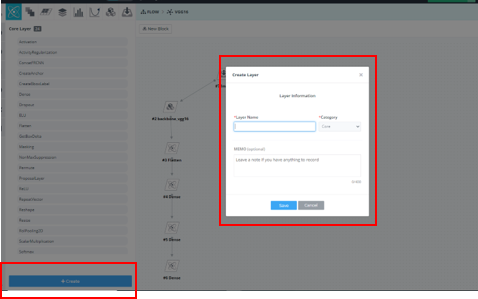
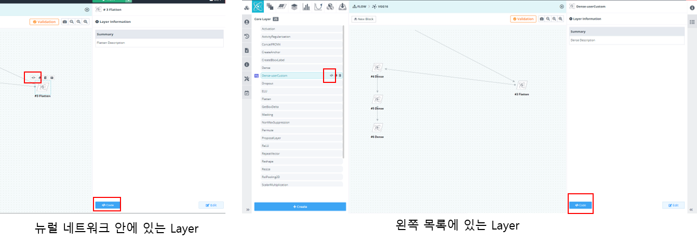
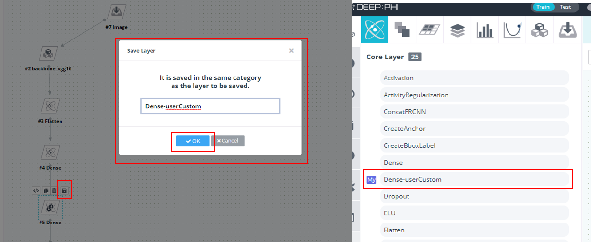

# Version 2020-04.12290001(12100001)

#### New Feature

1.뉴럴네으퉈크 모델러에 새로운 카테고리 추가
> 1-1 Input Layer Category 추가

> 1-2 Block Layer Category 추가

2.뉴럴네트워크 모델러 편집기 기능 업데이트
> 2-1 Layer 생성 기능 추가

> 2-2 Layer 복사 삭제 기능 추가
- 기존에 존재하는 Layer 를 복사 하여 사용자 개인의 Layer 로 편집 가능

> 2-3 Layer 이름 및 설명 편집 기능 추가
- Edit 버튼 클릭을 통해 My Layer 의 이름 및 설명 편집 가능

> 2-4 Layer 소스 코드 편집 기능 추가
- <-> 버튼 과 Code 버튼 선택을 통해 코드 편집창 진입 가능

- Layer 들을 실제로 구성하고 있는 소스 코드를 확인 및 My layer 에 한해서 편집 가능

> 2-5 Layer 파라미터 편집 기능 추가
- 소스코드를 편집 가능 함에 따라 소스코드에 사용하는 파라미터 편집 가능

> 2-6 뉴럴네트워크를 구성하고 있는 Layer, Block 를 My 로 저장 기능 추가
- 뉴럴 네트워크에서 사용 하기위해 사용자가 편집한 Layer 를 My로 저장하여 다른 네트워크 조립 시에 재사용 가능
- 뉴럴 네트워크에서 자주 사용하는 Block를 My 로 저장 하여 다양한 네트워크 조립 시에 재사용 가능

#### Improvement

1. 뉴럴네트워크 모델러 편집기의 Validation 기능 강화
- Validation 를 통해 문제가 발생하는 Layer 에 대해 편집기에서 빨간색 Layer로 표현

#### Bug

#### Task

- 튜토리얼 동영상 추가

- 메뉴얼 업데이트
  - [3-5.6. 커스텀 Layer 만들기](https://deepphi.github.io/manual/chapter3/3-5.성능_고도화.html#6-hyper-parameter-auto-tunning)

