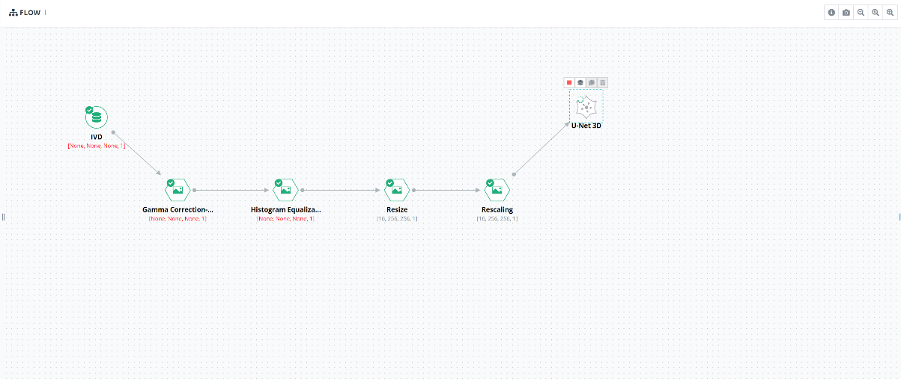
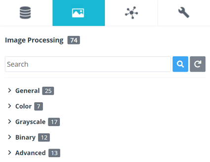
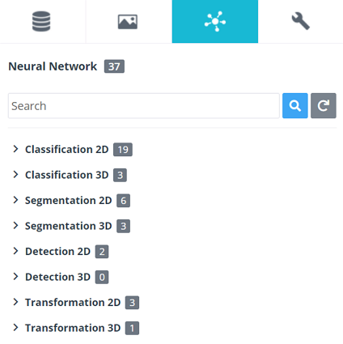
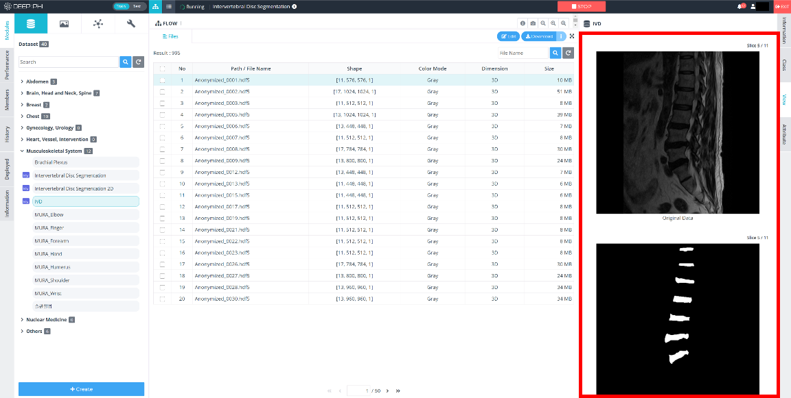
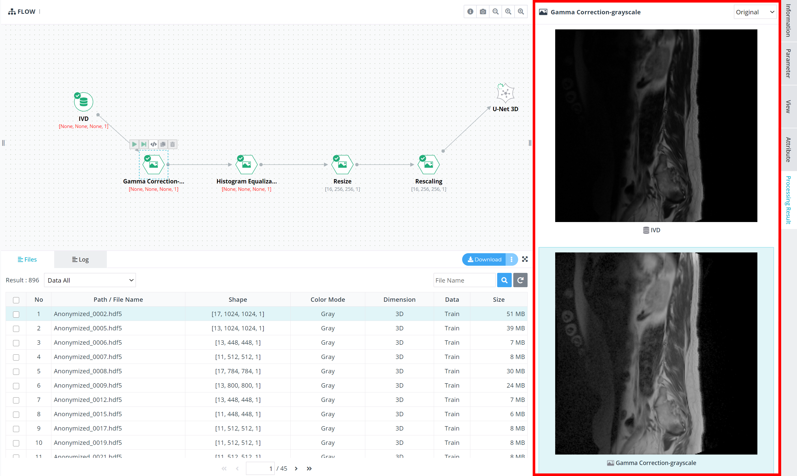
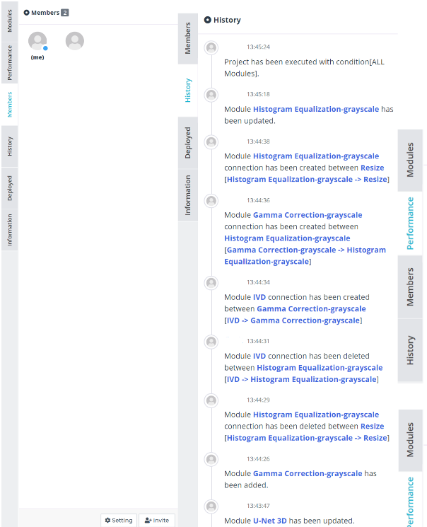

# 1. 플랫폼 소개

***

## 1-3. 주요기능

### 1) GUI(Graphic User Interface) 기반 모델러

기존 인공지능 연구 방법과 달리 DEEP:PHI 플랫폼은 연구자가 별도의 프로그래밍 과정 없이 빠른 속도로 연구를 수행할 수 있도록 인공지능 알고리즘 연구 과정에서 사용하는 다양한 기능들을 GUI 기반으로 구성한 뒤 이를 Flow space에서 블럭을 조립하는 것처럼 연결하여 간편하게 전체 연구 모델을 구성할 수 있습니다.

  

### 2) 기능 모듈

DEEP:PHI 플랫폼은 사용자가 별도의 코딩과 프로그래밍 지식이 없어도 인공지능 알고리즘을 연구할 수 있도록 딥노이드의 전문 연구인력들이 연구 과정에서 사용되는 기반 기능들을 모듈화하고 이를 편리하게 드래그&드롭으로 사용할 수 있도록 형성되어 있습니다. 각 모듈들은 기능 별 공통 카테고리로 관리되며 각각 Dataset, Image Processing, Neural Network, Data Manipulation으로 구성되어 있습니다.

#### I. Dataset

> - 사용자의 플랫폼 적응성을 높이고 다양한 연구를 수행할 수 있도록 DEEP:PHI에서 기본적으로 제공하거나 타 사용자들이 공유한 데이터셋과 사용자가 업로드한 데이터셋을 모듈 형태로 사용 가능하도록 제공하고 있습니다.

 

#### II. Image Processing

> - 의료 영상 인공지능은 의료 영상을 기반으로 생성되는 모델이기 때문에 알고리즘의 학습 전, 후 단계에서 다양한 종류의 영상처리 알고리즘이 필요합니다.  
> - DEEP:PHI 플랫폼에선 딥노이드의 전문 연구인력에 의해 생성되어 다양한 의료 영상 인공지능에 사용되고 있는 영상처리 알고리즘들을 기능 카테고리 별로 정리하여 제공하고 있습니다.

 

#### III. Neural Network

> - 일반적으로 의료 인공지능은 지도학습(Supervised Learning)을 기반으로 하는 인공 신경망(Artificial Neural Network)으로 구성되어 있습니다.  
> - DEEP:PHI 플랫폼에선 딥노이드의 전문 연구인력들이 다양한 의료 영상 연구 과정에서 생성한 여러 종류의 인공 신경망 알고리즘을 기능 카테고리 별로 정리하여 제공하고 있습니다.
 
 

#### IV. Data Manipulation

> - 사용자가 직접 데이터셋의 구조를 변경할 수 있도록 데이터셋과 모듈 출력물(output)에 대한 변경 작업을 수행할 수 있는 다양한 기능들이 탑재되어 있습니다.

  

### 3) 시각화

DEEP:PHI 플랫폼은 의료 영상을 활용한 인공지능 알고리즘 연구 단계에서 각 과정 별로 사용되는 모듈의 입, 출력 결과에 대한 시각화 기능과 알고리즘 성능지표들에 대한 시각화 기능을 제공합니다.  
이를 통해 다양한 모듈의 입, 출력 영상을 샘플로 확인하고 해당 모듈이 어떠한 기능을 하여 영상을 변화시켰는지 사용자가 직접 확인할 수 있습니다.  
추후 이러한 시각화 기능들을 종합하여 연구 보고서로 별도 출력할 수 있는 기능이 추가될 예정입니다.

#### I. 데이터 시각화

> - 사용자가 업로드했거나 딥노이드에서 제공하는 Shared 데이터셋들의 데이터의 구조와 크기, 입력 데이터와 라벨 데이터의 비교 등을 한눈에 제공함으로써 연구 편의성을 제공합니다.

 

#### II. 영상처리 시각화

> - DEEP:PHI 플랫폼에선 연구 Flow space에서 데이터의 흐름을 사용자가 이해하기 쉽게 시각화해서 전달합니다.  
> - 입, 출력 영상의 형태(Shape)와 영상 자체를 보여줌으로써 해당 모듈을 거치면 영상이 어떻게 변화하는지 눈으로 직접 확인할 수 있습니다.  
> - 이러한 과정을 통해 사용자가 데이터를 직접 가공하고 확인하면서 알고리즘의 성능을 향상시킬 수 있는 방법을 찾아갈 수 있게 됩니다.

 

#### III. 인공지능 성능지표 시각화

> - 인공지능 학습 과정에서 산출되는 다양한 학습 성능 지표들을 수치로 확인 가능할 뿐만 아니라 다양한 그래프를 통해 직관적으로 확인할 수 있습니다.

  

### 4) 연구 프로젝트 관리도구

기관이나 연구자와의 협업 연구를 위한 프로젝트 인력 관리 도구부터 연구 이력, 각 실행 별 성능 수치의 비교까지 다양한 관리 도구를 통해 DEEP:PHI 플랫폼은 사용자의 연구과정을 편리하게 만들어줍니다.

*<연구 프로젝트 인력 관리(좌), 프로젝트 실행 이력(중), 각 실행 별 성능 비교(우)>*