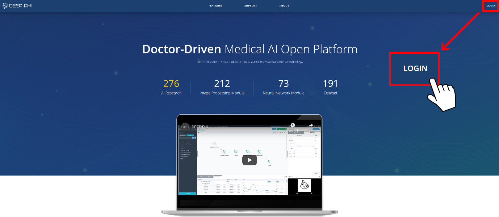
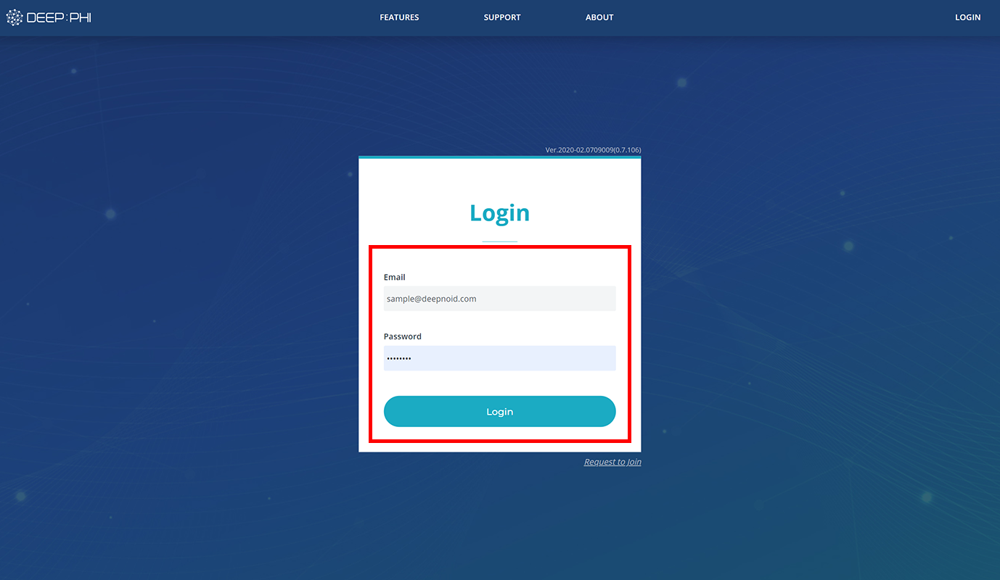

# 2. 화면 구성

***

## 2-1. 로그인

① DEEP:PHI 플랫폼의 메인페이지 주소(https://deepphi.ai)로 접속합니다.  
② 우측 상단의 LOGIN 버튼을 눌러 사용자의 계정으로 로그인을 할 수 있습니다.  
③ 회원가입에 사용한 이메일 주소를 입력합니다.  
④ 계정 비밀번호를 입력합니다.  
⑤ Login 버튼을 눌러 플랫폼에 로그인 합니다.  

로그인에 성공하면 프로젝트 Dashboard 화면으로 진입합니다.