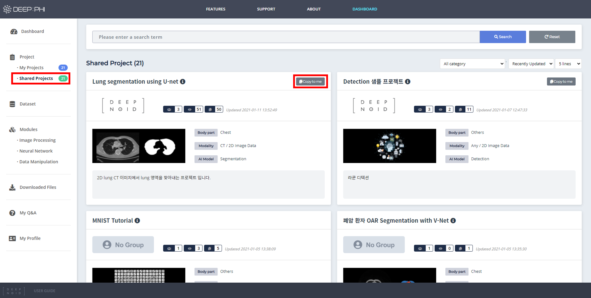

# 3. 사용 방법

***

## 3-1. 프로젝트 시작하기

프로젝트를 시작하는 방법은 두 가지가 있습니다.
직접 새로운 프로젝트를 생성해서 사용하거나, 공개된 Shared 프로젝트를 복사하여 사용할 수 있습니다.  

  

### (1) Shared 프로젝트 사용하기

Shared 프로젝트는 다른 유저가 생성하여 전체 유저에게 공개한 프로젝트입니다.
 
Dashboard의 Project > Shared Projects 에서 Shared 프로젝트의 목록을 확인할 수 있습니다.

* 상단에서 이름으로 프로젝트를 검색하거나, 프로젝트를 분류별로 정렬할 수 있습니다.
* 프로젝트 이름을 클릭하면 프로젝트 내부 구성을 확인할 수 있습니다.
* 사용하고 싶은 프로젝트 우측 상단의 Copy to me 버튼을 클릭하면 My Project로 복사됩니다.
* 복사된 프로젝트에서 데이터셋만 교체하여 사용할 수도 있고, 내부 모듈을 편집하여 사용할 수도 있습니다.

### (2) My 프로젝트 사용하기

사용자가 직접 프로젝트 파이프라인을 만들고 싶은 경우 My Project에서 새로운 프로젝트를 생성해 사용할 수 있습니다. 

Dashboard의 Project > My Projects 에서 +Create 버튼을 클릭하면 프로젝트 생성 마법사가 실행됩니다.

프로젝트 생성 단계는 다음과 같습니다. (*표시는 필수 입력 정보입니다.)

① 프로젝트의 이름과 업로드하려는 데이터셋의 촬영 부위, 영상의 종류, 요약 내용 등과 프로젝트 목표일을 입력합니다. My Project에서 각 프로젝트의 커버 이미지를 표시하고 싶은 경우 커버 이미지를 업로드하여 사용할 수 있습니다. (선택사항)

② 프로젝트의 연구 목적을 설명할 수 있는 상세정보를 입력합니다.

③ 프로젝트에서 사용하려는 AI 알고리즘의 종류를 선택합니다.

④ 프로젝트에 사용할 데이터셋의 차원을 선택합니다.  

* 2D 데이터셋 - X-ray와 같이 순서가 존재하지 않는 낱장의 이미지들으로 이루어진 경우  
* 3D 데이터셋 - CT나 MRI처럼 환자 단위로 연속적인 하나의 볼륨이 구성되어 각 데이터간 순서가 존재하는 경우

⑤ 설정을 완료하고 프로젝트를 생성합니다.

프로젝트 생성시 입력한 정보와 유사한 Shared 프로젝트가 존재하면 해당하는 프로젝트가 추천되며, 이를 이용해 프로젝트를 생성할 수 있습니다.