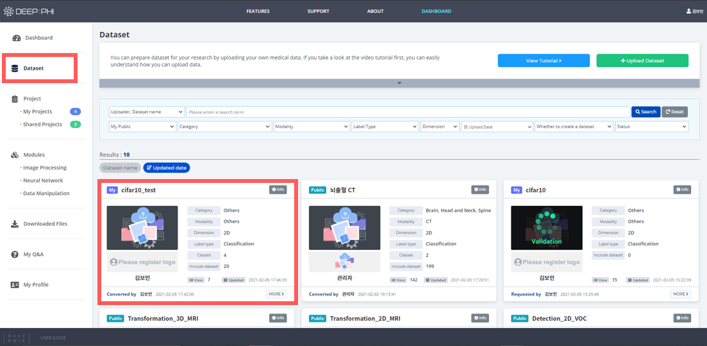

# 3. 사용 방법

***

## 3-2. Dataset 모듈

### (1) 데이터셋 업로드

DEEP:PHI에서 기본으로 제공하는 공개 데이터셋을 이용할 수도 있지만, 사용자가 직접 데이터셋을 업로드할 수도 있습니다.

 

프로젝트 모델러 화면에서 Dataset 모듈 탭 하단의 +Create 버튼을 클릭하거나, Dashboard의 Project > My Projects 에서 +Create 버튼을 클릭하여 데이터셋을 업로드할 수 있습니다.

 

데이터셋 업로드 단계는 아래와 같습니다. (*표시는 필수 입력 정보입니다.)

 

① 데이터셋 업로드 마법사가 처음 실행되는 화면에서는 데이터셋 업로드 방법에 대한 튜토리얼 영상을 볼 수 있습니다.  
DEEP:PHI 플랫폼에서 사용하는 데이터셋은 몇 가지 고정된 폴더 구조만을 지원하기 때문에 데이터셋 업로드 전 꼭 튜토리얼 영상을 시청하시는 것을 권장드립니다. 업로드 폴더 구조에 대한 자세한 내용은 `4. 부록 > 4-1. 업로드 데이터셋 구조`에서 확인하실 수 있습니다.

 

② 튜토리얼 다음 단계에선 프로젝트 생성 마법사와 유사한 형태로 데이터셋 모듈에 대한 정보들을 입력할 수 있습니다.  
데이터셋의 촬영 부위, 영상의 종류, 요약 내용 등을 입력하고 데이터셋의 커버 이미지를 표시하고 싶은 경우 선택적으로 커버 이미지를 업로드하여 사용할 수 있습니다.

 

③ 데이터셋에 대한 상세정보를 입력합니다.

 

④ `4. 부록 > 4-1. 업로드 데이터셋 구조`에 맞는 데이터셋이 준비되었다면 우측 하단의 `Browse` 버튼을 눌러 해당 폴더 전체를 압축한 압축파일을 업로드합니다.  
업로드된 데이터셋들은 암호화하여 DEEP:PHI 플랫폼의 저장공간에 안전하게 저장됩니다. **특히 개인 정보가 담길 수 있는 Dicom 파일(.dcm 포맷)의 경우 Dicom Tag들을 비 식별화(de-identify, anonymize)한 뒤 업로드됩니다.**  비 식별화 항목은 `4. 부록 > 4-2. Dicom 파일 비 식별화 항목`에 안내되어 있습니다.

 

⑤ 모든 설정을 완료하고 데이터셋 업로드를 시작하면 상태 창을 통해 업로드 상태를 확인할 수 있습니다.  
`Minimize Windows`를 클릭하면 백그라운드에서 업로드 작업을 수행하기 때문에 업로드 중에 다른 작업을 수행할 수 있습니다.

  

### (2) 데이터셋 관리하기

Dashboard의 Dataset에서 데이터셋을 관리할 수 있습니다.  

* 모두에게 공개된 Shared 데이터셋과 사용자가 직접 업로드한 My 데이터셋을 관리할 수 있습니다.
* 상단에서 이름으로 프로젝트를 검색하거나, 프로젝트를 분류별로 정렬할 수 있습니다.
* File View를 클릭하면 프로젝트 내부 구성을 확인할 수 있습니다.
* 업로드한 데이터셋이 업로드 구조 규칙과 맞지 않거나 데이터셋에 잘못된 파일이 존재하는 경우 우측 상단에 Error 표시가 출력됩니다.

  

### (3) Dataset 모듈 사용하기

Dataset 모듈은 사용자가 직접 업로드한 My 데이터셋과 딥노이드에서 공유하고 있는 Shared 데이터셋으로 구성되어 있습니다. 데이터셋은 촬영 부위 별로 구분되어 있어 각 카테고리에서 데이터셋을 찾거나, 검색창을 이용해 필요한 데이터셋을 찾을 수 있습니다.

 

- 데이터셋은 촬영 부위별로 구분되어 있습니다.  
- 사용자가 직접 업로드한 데이터셋은 데이터셋 모듈 이름 좌측에 `My` 태그가 표시되어 있습니다.  

 

- 중앙 하단에서 데이터셋에 포함된 파일 목록을 확인할 수 있습니다.
- 우측 영역에서 해당 모듈의 정보와 각 영상을 확인하고, 파라미터를 설정할 수 있습니다.

 

Dataset 모듈은 총 7개의 메뉴를 이용할 수 있습니다.

- 위 3개 메뉴는 데이터셋 전체에 적용되는 메뉴입니다.  
  -*Information: 모듈 상세설명*  
  -*Class: 데이터셋의 Class 정보*  
  -*Data Setting: Test/Validation/Train에 사용할 데이터셋의 비율 설정*

- 아래 4개 메뉴는 하단 Files 탭에서 선택한 데이터에 해당되는 메뉴입니다.  
  -*View: 선택한 데이터의 영상*  
  -*Attribute: 선택한 데이터의 Shape, Pixel Intensity Range 등의 속성값*  
  -*Processing Result: 선택한 영상의 처리 과정*  
  -*Histogram Result: 선택한 데이터의 channel별 pixel 값의 histogram*