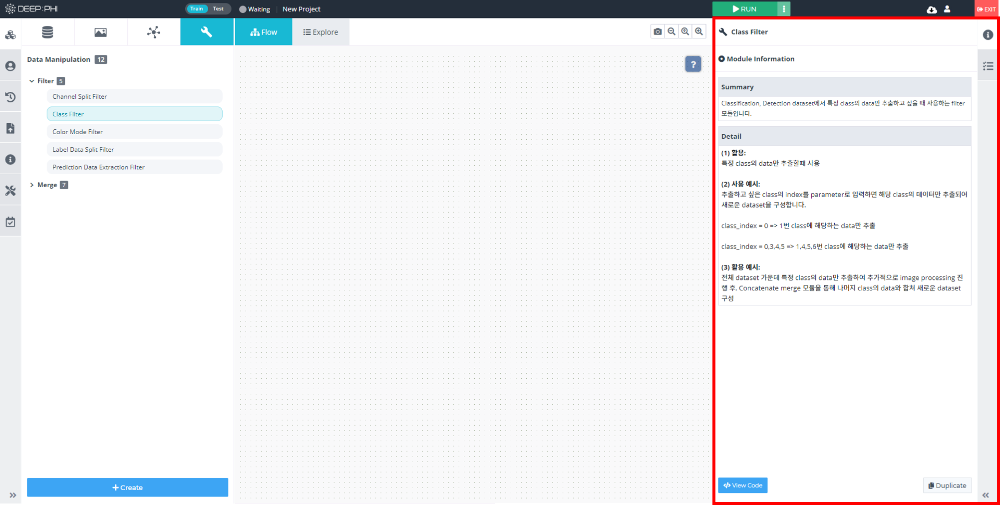
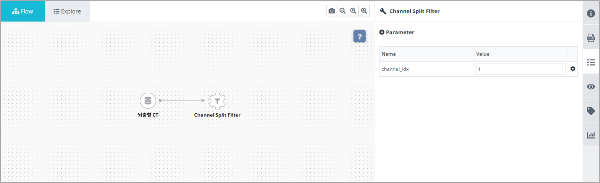
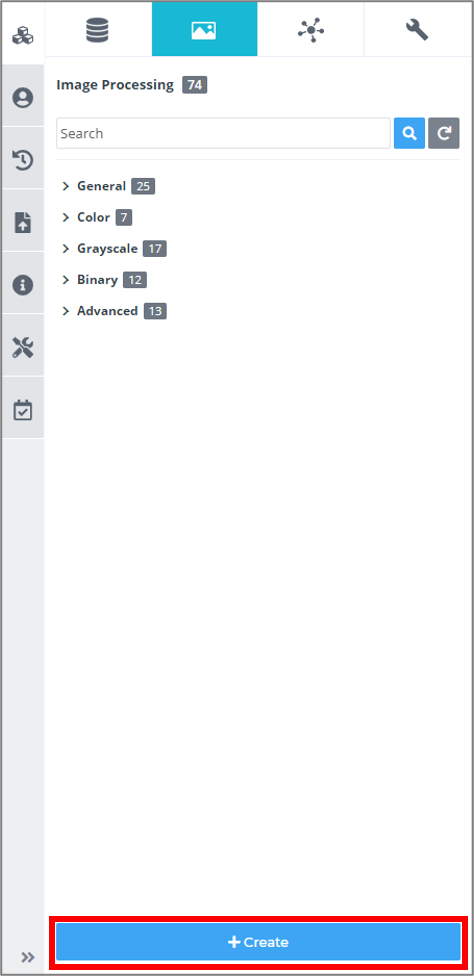
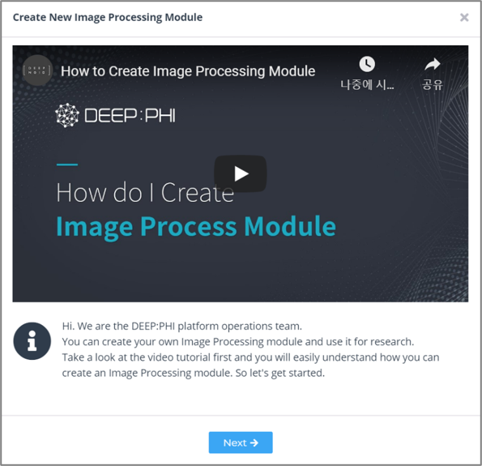
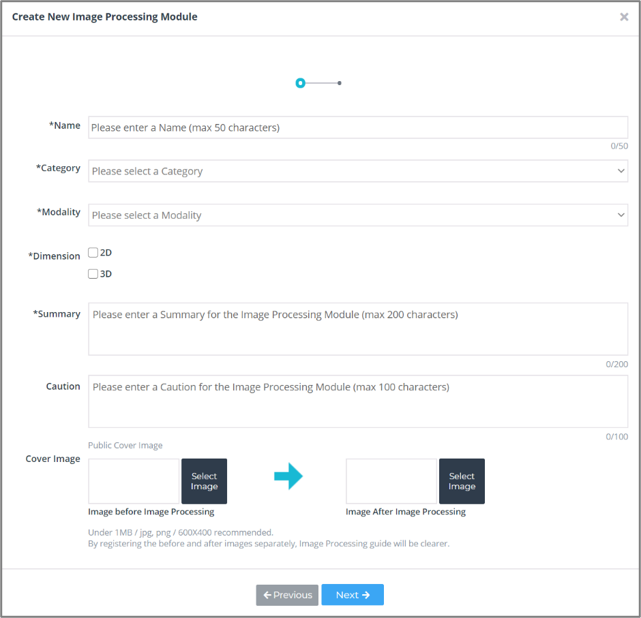
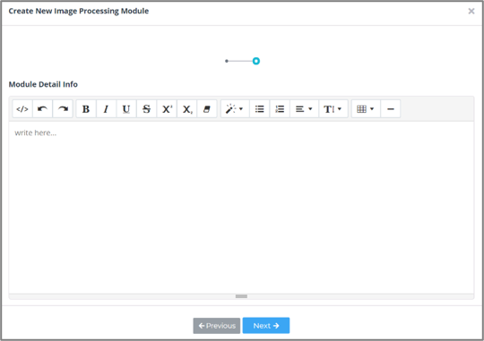
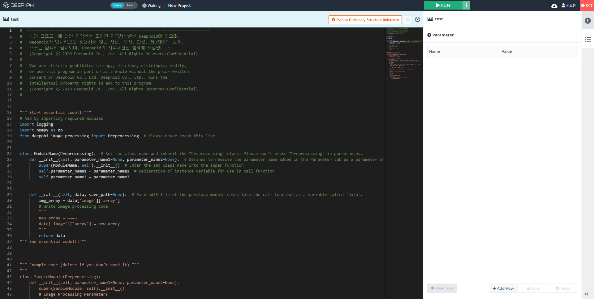
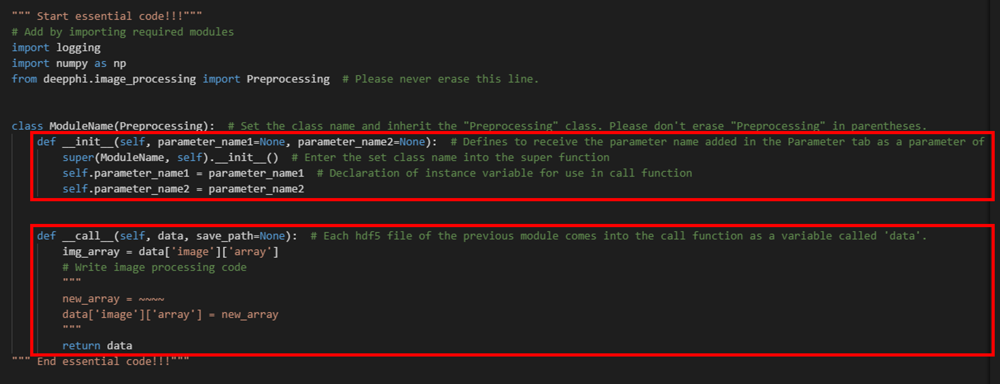
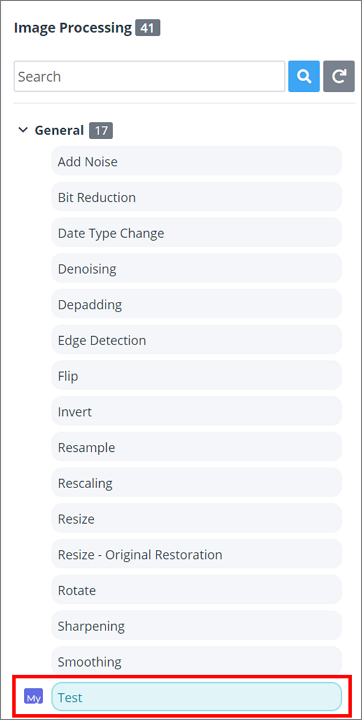

# 3. 사용 방법

***

## 3-4. Data Manipulation 모듈

Data Manipulation 모듈은 데이터셋에서 특정 조건의 데이터만 추출하거나 (Filter), 두 개 이상의 데이터를 병합할 때 (Merge) 사용하는 모듈입니다.

  

### (1) Data Manipulation 모듈 사용하기

① Data Manipulation 모듈은 Filter와 Merge 두 종류가 있습니다.

Filter 모듈은 특정 조건에 맞는 데이터만 추출하는 역할을 하며,

Merge 모듈은 두 개 이상의 데이터를 하나로 합쳐 주는 역할을 합니다.

② 모듈을 선택하면 우측 메뉴의 Information탭에서 모듈의 정보와 상세설명, 활용예시를 확인할 수 있습니다.

해당 Information을 확인하고 상황에 맞는 모듈을 적절히 사용하면 됩니다.

③ 사용할 모듈을 가운데 Flow workspace에 배치하고, 모듈을 연결합니다.

모듈은 연결한 순서대로 처리됩니다.

④ 모듈을 클릭하고 우측 메뉴의 Parameter 탭에서 파라미터를 설정합니다. 

각 파라미터에 대한 설명은 Information 탭에서 확인할 수 있고, 각 변수 이름에 커서를 올리면 간단한 설명이 팝업됩니다.

⑤ 하단의 Files 탭과 우측 메뉴의 Attribute 탭 등을 통해 처리과정을 확인할 수 있습니다. 

  *모듈 실행 후 확인할 수 있음*

  

### (2) Custom Data Manipulation 모듈 제작하기

데이터를 가공하는 것은 각 데이터의 도메인 지식(Domain Knowledge)에 영향을 많이 받습니다. 사용할 데이터셋의 영상이 가지는 특성, 그중에서도 영상을 얻는 분야의 배경지식 등을 적용해서 가공을 수행할 수 있습니다. 예를 들어 CT 데이터는 일반적인 0 ~ 255 스케일의 값이 아닌 HU(Hounsfield Units)이라고 하는 데이터를 각 픽셀마다 저장하고 있어, 이를 이용한 새로운 전처리 기법을 적용할 수 있습니다.

이처럼 각 데이터마다 존재하는 특수한 특성들을 다루기 위한 새로운 Custom 모듈을 사용자가 직접 제작할 수 있습니다.

Image Processing 모듈 탭 하단의 +Create 버튼을 클릭하면 Image Processing 모듈 생성 마법사가 팝업됩니다.

모듈 생성 단계는 아래와 같습니다. (*표시는 필수 입력 정보입니다.)

① 모듈을 생성하기 전 튜토리얼 영상을 확인하면 모듈 생성 과정에 많은 도움이 됩니다.

② 모듈의 이름, 분류 카테고리, 사용하는 데이터의 Modality 정보, 사용하는 데이터의 차원 등 필요한 정보들을 입력합니다.

③ 데이터셋에 대한 상세정보를 입력하고 Next 버튼을 누르면 모듈 내부를 편집할 수 있는 소스코드 에디터가 팝업됩니다.

④ 소스코드 에디터는 실제 영상처리를 수행하는 부분을 제외한, 데이터의 입출력과 관련된 부분이 미리 작성되어 있으며 아래에는 예시 코드가 있습니다.

따라서 사용자는 간단한 파이썬 코딩 스킬과 라이브러리 사용방법만 익히고 있다면 간단하게 모듈을 생성할 수 있습니다.

⑤ 모듈은 Class의 형태를 띄고 있습니다. 크게 파라미터 설정 부분과 동작 부분으로 나뉩니다.

<모듈 파라미터 설정/추가>
- __init__() 부분에는 입력 받을 파라미터에 관한 내용을 입력합니다. 
- 만약 외부에서 입력 받을 파라미터가 있다면 우측 Parameter 탭에 추가합니다.
- 이 파라미터는 __init__() 부분에서 입력받아 class의 내부에서 사용할 수 있습니다.
- 우측 Parameter 탭에서 +Add Row 버튼을 눌러 파라미터를 추가할 수 있습니다.
- __init__()에서 인식할 파라미터의 이름과 파라미터 타입을 선택하고, 파라미터에 대한 정보를 작성하면 됩니다.
- 파라미터 타입은 Selection, Direct Input, File Upload 세 가지 종류가 있습니다.
  *Selection: 여러 값 중 하나를 선택하는 방식*
  *Direct Input: 특정한 값을 입력받는 방식*
  *File Upload: 파일을 직접 입력으로 전달하는 방식*

<전처리 동작>
- 실제 모듈 동작과 관련된 코드는 class 안의 __call__() 함수에 작성하면 됩니다. 
- __call__() 함수는 data라는 이름으로 데이터를 하나씩 받고, Image Processing을 거친 후 return합니다. 
- data는 데이터의 각종 정보를 담고 있는 dictionary type입니다.
- 원본 영상은 data['image']['array']에 있습니다.
- data[‘image’][‘array’]에서 원본 영상을 꺼내고, 여기에 처리를 수행한 후 다시 data[‘image’][‘array’] 에 넣어 주고 data를 return 해주면 됩니다.
- 모듈의 데이터 입출력 구조는 [4-2. DEEP:PHI 플랫폼 모듈의 입/출력 구조]에 설명되어 있습니다. 또는, 소스코드 에디터 우측 상단의 [!Python Dictionary Structure Reference]를 클릭하면 해당 링크로 이동합니다. 이를 참고하여 코드를 작성해 주시길 바랍니다.

⑥ 코드를 저장하고 소스코드 에디터에서 나가면 모듈 제작이 완료됩니다. 생성된 Custom 모듈은 모듈 리스트에서 확인할 수 있고, 이름 좌측에 My 태그가 붙습니다.
