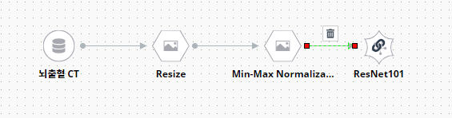
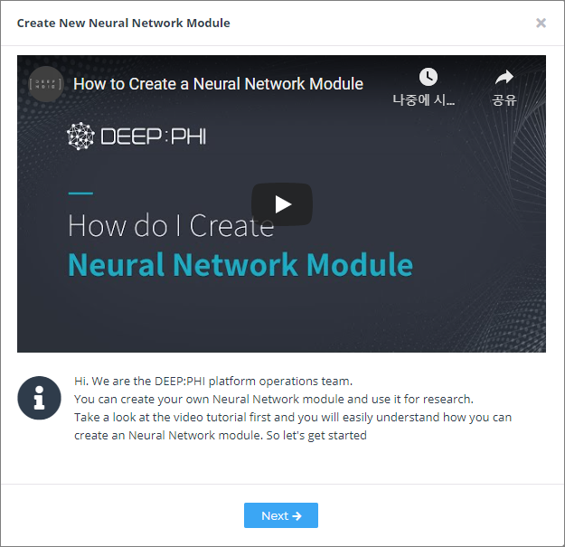
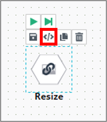

# 3. 사용 방법

***

## 3-5. Neural Network 모듈

데이터셋 불러오기와 가공을 마쳤으면 최종적으로 데이터셋을 Neural Network 모듈에 연결해 신경망을 학습합니다.

DEEP:PHI 플랫폼에는 지도학습(Supervised Learning) 기반의 인공지능 알고리즘들이 탑재되어 있습니다. 신경망(Neural Network)은 생물의 신경계를 수학적으로 모사하여 작동하도록 설계된 알고리즘입니다. 다양한 방법을 사용해서 입력 데이터로부터 의미있는 특징(Feature)들을 추출하고 이 특징들을 각 신경망 노드들이 학습하면서 정답을 찾아가도록 만들어져 있습니다.  

신경망을 통해 데이터를 분석하려는 목적에 따라 크게  Classification, Segmentation, Detection, Transformation으로 나눌 수 있습니다.

- Classification : 입력 데이터를 통해 데이터의 Class를 분류하는 작업을 수행합니다.
  *ex) 정상 환자 vs 비정상 환자의 구분, 양성 종양 vs 악성 종양의 구분 등*
- Segmentation : 입력 데이터를 통해 데이터의 특정 영역을 분할하는 작업을 수행합니다.  
  *ex) Brain MRI 영상에서 enhancing tumor, tumor core, whole tumor를 구분하여 추출*
- Detection : 입력 데이터를 통해 데이터에서 물체의 위치를 탐지하는 작업을 수행합니다.  
  *ex) Lung CT 영상에서 Lung Nodule의 위치를 좌표로 탐지*
- Transformation : 하나의 이미지를 다른 이미지로 변환합니다.
  *ex) T1-weighted MRI를 T2-weighted MRI로 변환*

> DEEP:PHI 플랫폼에선 인공지능 연구원들이 실제 연구 과정에서 사용하고 있는 다양한 종류의 신경망들을 지속적으로 플랫폼에 업데이트하고 있습니다.  

  

### (1) Neural Network 모듈 사용하기

① Neural Network 모듈은 수행하는 task에 다라 분류되어 있습니다.  

 

② 모듈을 선택하면 우측 메뉴의 Information탭에서 모듈의 정보와 상세설명을 확인할 수 있습니다.

해당 Information을 확인하고 적절한 모듈을 사용하면 됩니다.

 

③ 사용할 모듈을 가운데 Flow workspace에 배치하고, 모듈을 연결합니다.

Neural Network에 연결된 모듈이 신경망에 입력으로 들어옵니다.

 

④ 모듈을 클릭하고 우측 메뉴의 Parameter 탭에서 학습에 필요한 파라미터를 설정합니다. 

신경망을 학습시킬 때에는 여러 파라미터의 조정이 필요합니다. 신경망 파라미터의 값에는 정답이 없기 때문에 여러 번 실험을 거쳐 가장 최적의 결과를 내는 값을 선택애햐 합니다.

신경망 파라미터의 목록은 다음과 같습니다.

- Parameter: 신경망 학습 과정과 관련이 있는 파라미터입니다.
  *epoch: 학습을 몇 회 반복할지를 결정합니다.*
  *batch_size: 한번에 몇 개의 데이터를 가지고 학습을 진행할지를 결정합니다. batch_size가 클 수록 학습은 빠르게 진행되나 resource가 많이 요구됩니다.*
  *learning_rate_decay: 매 epoch마다 learning rate를 감소시킬 비율을 결정합니다.*
- Augmentation: 데이터에 변형을 가해 데이터의 수를 늘림으로써 신경망의 과적합을 방지하는 효과가 있습니다.
  *Augmentation을 많이 사용할수록 과적합을 방지할 수도 있지만 데이터 수가 늘어나 학습 시간이 증가합니다.*
- Optimizer: 신경망 학습은 내부의 수많은 weight를 업데이트하는 방식으로 이루어집니다. 이 업데이트에 사용할 최적화 방식을 설정합니다.
  *learning rate: 한 번 업데이트에 얼만큼 가중치를 줄 것인지를 결정합니다.*
  *Optimizer의 종류마다 설정할 파라미터의 종류가 서로 다릅니다.*

파라미터 분류 옆의 `i` 아이콘을 클릭하면 각 파라미터에 대한 자세한 설명과 docs로 연결되는 링크를 확인할 수 있습니다.

 

⑤ 우측 메뉴의 Early Stopping 탭을 이용해 학습 시간을 단축시킬 수 있습니다.

Early Stopping 기능은 더이상 신경망의 성능 변화가 없을 때 학습을 종료하는 기능입니다.

- Neural Network 모듈을 클릭하고 우측 메뉴의 Early Stopping 탭을 선택합니다.
- Early Stopping의 기준이 되는 Class를 선택합니다.
- Early Stopping의 기준이 되는 성능 척도를 선택합니다.
- Early Stopping의 기준이 되는 성능 변화의 정도를 설정합니다.
  *Min delta: 기준으로 선택한 성능이 이 값 이하로 변화하면 더이상의 성능 변화가 없다고 판단합니다.*
  *Patience: 기준으로 선택한 성능이 이 값의 epoch 동안 변화가 없으면 Early Stopping을 수행합니다.*

  

### (2) Auto Tuning

신경망은 파라미터의 값에 따라 성능에 큰 차이가 발생합니다. 

Auto Tuning은 유전 알고리즘을 이용하여 주어진 데이터셋과 신경망에 가장 최적화된 파라미터를 탐색하는 기능입니다. 사용자가 학습과 관련된 하이퍼파라미터들을 바꿔가면서 실험을 하지 않아도, 알고리즘이 실험을 통해서 성능을 개선시키는 방향으로 파라미터를 탐색합니다.

 

① Flow workspace에 추가한 Neural Network 모듈을 클릭하고 모듈 위의 돋보기 아이콘을 클릭합니다.

 

② 설정 창에서 최적화를 수행하고 싶은 파라미터의 체크박스를 체크합니다. 체크가 되지 않은 파라미터는 최적화를 수행하지 않고, 해당 값으로 학습을 진행합니다. 예를 들어 위 그림의 경우 epoch은 50으로 고정하고, batch size, learning rate decary, optimzier에 대해서 학습 파라미터를 탐색합니다.

 

③ 성능을 개선하고 싶은 지표를 선택합니다. 알고리즘은 사용자가 선택한 점수를 개선하는 방향으로 파라미터를 탐색합니다. 위 그림의 경우 알고리즘은 validation accuracy를 개선하는 파라미터를 찾습니다.

 

④ Neural Network 모듈을 클릭하고 하단의 Auto Tunning 탭을 클릭하면, 성능이 개선되고 있는지 그래프를 통해 확인할 수 있습니다.

 

⑤ Auto Tunning 탭에서 Table 버튼을 누르면, 각 지표별로 상위 5개의 성능을 내는 파라미터 조합을 확인하실 수 있습니다. 파라미터 옆의 Apply 버튼을 누르면 해당 파라미터가 신경망에 적용됩니다.

  

### (3) Custom Neural Network 모듈 제작하기

DEEP:PHI에서 기본으로 제공하는 Neural Network 모듈 외에도, 수많은 종류의 신경망이 존재하고 새롭게 발표되고 있습니다.

새로운 구조의 신경망을 직접 만들고 싶은 경우 Custom Neural Network 모듈을 제작할 수 있습니다.

Neural Network 모듈 탭 하단의 +Create 버튼을 클릭하면 Image Processing 모듈 생성 마법사가 팝업됩니다.

모듈 생성 단계는 아래와 같습니다. (*표시는 필수 입력 정보입니다.)

 

① 모듈을 생성하기 전 튜토리얼 영상을 확인하면 모듈 생성 과정에 많은 도움이 됩니다.

 

② 신경망의 이름, 분류 카테고리, 요약 등 필요한 정보들을 입력합니다.

 

③ 신경망에 대한 상세정보를 입력하고 Next 버튼을 누르면 모듈 내부를 편집할 수 있는 신경망 모델 빌더가 팝업됩니다.

 

④ 신경망 모델 빌더는 프로젝트 내부와 마찬가지로 좌측에는 신경망을 구성하는 Layer의 목록으로 구성되어 있으며 중앙 영역은 Flow workspace로 되어 있습니다. 프로젝트 파이프라인 구축과 마찬가지로 좌측 메뉴에서 필요한 Layer을 드래그&드롭하고 다른 Layer과 연결하여 신경망을 구성할 수 있습니다.

 

⑤ Layer은 총 8개 카테고리로 구분되어 있으며, keras 라이브러리를 기반으로 동작합니다. 각 카테고리는 다음과 같습니다.

- Core Layer: `Resize`, `Flatten`, `Activation` 등 기본 핵심 Layer들을 포함합니다.
- Convolution Layer: `Conv2D` 등 Convolution 연산을 수행하는 Layer들을 포함합니다.
- Pooling Layer: `AveragePooling`, `MaxPooling` 등 다양한 Pooling Layer들을 포함합니다.
- Merge Layer: `Add`, `Concatenate` 등 두 개 이상의 Tensor을 합치는 기능을 수행하는 Layer을 포함합니다.
- Normalization Layer: `BatchNormalization` 등 정규화를 수행하는 Layer들을 포함합니다.
- Loss Layer: `FocalLoss`, `CrossEntropy` 등의 다양한 Loss Layer들을 포함합니다.
- Block Layer: 사용자가 여러 Layer들의 묶음으로 정의한 Block Layer들을 저장할 수 있습니다.
- Input Layer: 신경망에 입력으로 들어오는 데이터의 Image, Label들을 사용할 수 있습니다.

 

⑥ 좌측의 Layer 목록에서 원하는 Layer 을 드래그하여 배치한 후, 순서에 맞게 연결해주면 됩니다.

가장 처음의 Layer은 Input Layer 의 `Image` Layer가 되어야 합니다.

`Image` Layer은 신경망에 입력으로 연결된 데이터셋을 받아오는 역할을 합니다. `Image` Layer의 뒤에 신경망을 구성하는 Layer 들을 배치하면 됩니다.

 

⑦ Layer을 원하는 순서에 따라 배치한 후, 우측 메뉴의 Layer Parameter 탭에서 Layer의 파라미터를 설정합니다.

예를 들어, Convolution Layer의 경우 filter 수, kernel size 등을 설정할 수 있습니다.

 

⑧ 반복되는 Layer들은 Block 단위로 묶어 사용할 수 있습니다.

좌측 상단의 New Block을 누르면 Block이 생성됩니다. 생성된 Block Layer 위의 돋보기 버튼을 눌러 Block 내부로 진입할 수 있습니다.

Block 내부에서 원하는 순서대로 Layer을 배치하면 됩니다.

  

### (4) Custom Layer 생성하기

<!-- 기존 내용 그대로 사용 -->

기존에 제공하는 Layer 이외에 추가로 사용자가 새롭게 생성하거나 기존 Layer의 편집을 통해서 사용자가 원하는 Custom 신경망 Layer를 만들어 사용할 수 있습니다.

① Layer 탭에서 만들고자 하는 Layer의 카테고리를 선택하고 하단의 `+Create` 버튼을 클릭하여 Layer 생성 마법사로 진입합니다.

 

② 사용자가 만들고자 하는 Layer의 이름과 설명을 작성하고 `Save` 버튼을 클릭합니다.

 

③ 사용자가 만든 Layer가 좌측의 목록에 `My`라는 표시와 함께 조회되고 해당 Layer를 선택한 후 코드 아이콘 `</>`를 클릭하면 소스코드 편집 창으로 진입합니다.

 

④ Layer의 코드를 작성하고 저장 버튼을 눌러 저장합니다.

 

- 파라미터 탭  

- 파라미터 설정  

⑤ 우측의 Layer Parameter 탭에서 파라미터를 추가하고 설정하여 사용 할 수 있습니다.

  

### (5) Neural Network 모듈 편집하기

<!-- 3-3-3과 동일 -->

모듈 리스트에 있는 모듈이나, Flow workspace에 추가한 모듈을 편집할 수 있습니다. 

같은 종류의 신경망이라도 깊이와 구조를 조정하면 성능이 달라질 수 있습니다. 혹은 신경망을 구성하는 각 layer의 activation function이나 initializer(초기화)를 수정함으로써 성능을 개선할 수도 있습니다.

기존에 만들어진 신경망에서 구조를 약간만 변형하여 원하는 구조의 신경망으로 만들고 싶은 경우에 사용할 수 있습니다.

 

- 모듈 리스트에서 모듈 이름 우측에 있는 코드 아이콘 `</>`을 클릭하거나, 우측 메뉴 Information 탭 하단의 `</>View Code` 버튼을 클릭하면 해당 모듈의 소스코드 편집창으로 진입합니다.
- 단, 기본 모듈의 경우 소스코드를 편집할 수 없고, 직접 생성한 Custom 모듈의 경우에만 소스코드를 수정하고 저장할 수 있습니다.

 

- 기본 모듈을 편집하기 위해서는 Flow workspace에 모듈을 추가한 후 수정해야 합니다.
- Flow workspace에 있는 모듈을 클릭하고 모듈 위의 코드 아이콘 `</>`을 클릭하면 소스코드 편집창으로 진입합니다.
- 소스코드를 수정하고 저장하면 Flow workspace에 있는 해당 모듈에만 수정사항이 반영됩니다.
- 코드 아이콘 왼쪽의 저장 아이콘을 누르면 수정한 모듈을 모듈 리스트에 저장할 수 있습니다.

