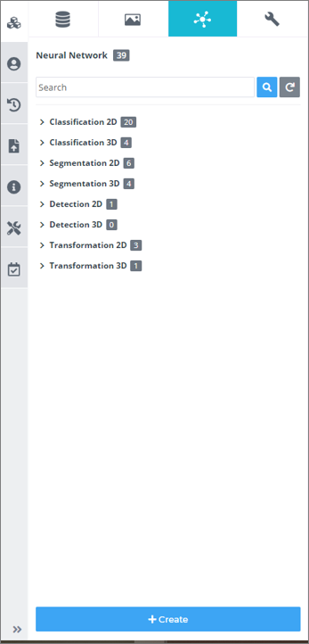
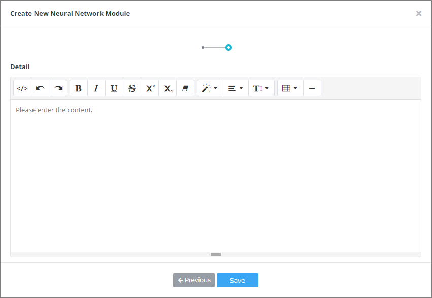

# 3. 사용 방법

***

## 3-5. 성능 고도화

이제 점진적으로 성능을 고도화 시키는 과정을 거치면 됩니다.  
이 과정은 많은 고민과 반복이 필요한 과정이며 어떠한 방법으로 파이프라인을 변화시키는가에 따라 학습 성능이 판이하게 차이가 날 수 있습니다.  
또한 매뉴얼에 안내되어 있는 방법 이외에도 다양한 성능 개선 방법들이 존재하므로 다양한 방법으로 데이터를 가공해보는 것이 성능을 올릴 수 있는 방법입니다.

 

### 1) 모듈 파라미터 수정

Image Processing 모듈과 신경망 모듈은 다양한 설정값(파라미터)이 존재합니다.
설정값들이 변경되면 데이터 가공방법과 학습 방법 등이 변경되므로, 데이터에 맞게 다양한 방법을 실험해 보고 값을 변경해 가며 휴리스틱(heuristic)하게 최적의 값을 찾아가는 과정을 거쳐야 합니다.
우측 탭의 Parameter 탭을 클릭해서 모듈의 설정값을 변경할 수 있으며 변경 항목의 이름에 커서를 올리면 사용 제약이나 간단한 설명이 팝업됩니다.

*<Gamma Correction-Grayscale 모듈의 설정 창>*

*<Histogram Equalization-Grayscale 모듈의 설정 창>*

*<Morphological Transformation-Grayscale 모듈의 설정 창>*

이처럼 각각의 모듈은 각기 다른 설정 방법과 설정값을 가집니다. 우측 탭의 Processing Result를 통해 데이터가 어떻게 변경됐는지 확인하는 과정을 거쳐서 사용합니다.

*<Processing Result 예시>*

  

### 2) Image Processing 모듈 바꿔보기/추가해보기

신경망을 포함한 다양한 기계학습 알고리즘들은 데이터 들에서 각각의 알고리즘에 맞는 특징(Feature)들을 추출한 뒤 특징 들에서 다양한 규칙들을 찾아내서 알고리즘에 적용하는 방식으로 학습하는 과정을 거칩니다.  
따라서 데이터를 raw 상태로 입력하는 것보다 가공해서 입력하는 것이 데이터에서 유의미한 특징들을 더 빠르게, 잘 추출할 수 있도록 하는 최고의 방법입니다.  
의료 영상을 학습하는 신경망도 마찬가지로 raw 상태의 의료 영상을 그대로 입력하는 것보다 영상처리 알고리즘을 거쳐 데이터에 여러 가지 변형을 가하여 데이터를 가공한 다음 신경망에 입력하는 것이 효과적입니다.  
아래 그림과 같이 영상처리 방법을 변경, 추가할수록 학습 성능이 향상되는 것을 확인할 수 있습니다.

 

*<별다른 영상처리 모듈 없이 학습을 수행했을 때>*

*<영상을 Grayscale로 변경 후 pixel value를 rescaling한 뒤 학습을 수행했을 때>*

>별다른 영상처리를 수행하지 않고 영상 사이즈만 균일화 시킨 뒤 학습을 수행했을 뿐이지만 정확도는 0.772에서 0.820으로 증가했습니다. 특이도 역시 0.708에서 0.822로 증가한 것을 확인할 수 있습니다. 
>각각의 데이터셋마다 다른 방법들을 적용해보고 실험의 반복을 통해 최적의 가공 과정을 찾아야 합니다.

  

### 3) 커스텀 Image Processing 모듈 만들기

데이터를 가공하는 것은 각 데이터의 도메인 지식(Domain Knowledge)에 영향을 많이 받습니다.  
예를 들어, 단순히 흉부 CT 영상에서 폐 결절(Lung Nodule)을 찾아내는 작업을 수행하기 위해 영상을 바로 신경망에 입력할 수도 있지만 데이터가 가지는 특성, 그중에서도 데이터가 생성되는 분야의 배경지식 등을 적용해서 가공을 수행할 수도 있습니다.  
CT 데이터는 HU(Hounsfield Units)이라고 하는 일반적인 0 ~ 255 스케일의 값이 아닌 데이터를 각 픽셀마다 저장하고 있습니다.  
이처럼 각 데이터마다 존재하는 Specific한 특성들을 다루기 위해서 DEEP:PHI 플랫폼에서 지원하는 모듈과 별개의 커스텀 모듈을 생성할 수 있습니다.

① 모듈 탭 하단의 +Create 버튼을 클릭해서 모듈 생성 마법사를 생성합니다.

 

② 모듈을 생성하기 전 튜토리얼 영상을 확인하면 모듈 생성 과정에 많은 도움이 됩니다.  
Next 버튼을 눌러 다음 단계로 넘어갑니다.

 

③ 모듈의 이름, 분류 카테고리, 사용하는 데이터의 Modality 정보, 사용하는 데이터의 차원 등 필요한 정보들을 입력 후 Next를 눌러서 다음 단계로 넘어갑니다.

 

④ 마지막으로 해당 모듈에 대한 자세한 정보를 적고 Next를 클릭하면 모듈 내부를 편집할 수 있는 소스코드 에디터가 팝업됩니다.

 

⑤ 팝업 된 소스코드 에디터는 위와 같이 실제 영상처리를 수행하는 부분을 제외한, 데이터의 입출력과 관련된 부분이 미리 작성되어 있습니다.  
따라서 사용자는 간단한 파이썬 코딩 스킬과 라이브러리 사용방법만 익히고 있다면 간단하게 모듈을 생성할 수 있습니다.  
모듈의 데이터 입출력 구조는 부록에 첨부되어 있으므로 반드시 확인하시고 모듈 생성을 수행하셔야 합니다.

 

⑥ 실제 모듈 동작과 관련된 핵심 실행 코드는 `class SampleModule` 안의 `def __call__()` 함수에 작성하면 됩니다. `__call__` 함수는 모듈의 인풋 데이터인 `data`를 입력 인자로 받기 때문에 `__call__` 함수 내부에서 `data`를 사용하여 모듈의 실행 코드를 작성합니다.  
부록4에 나와있는 것처럼 `data`는 Dictionary type입니다.  
위 예시 이미지처럼 `__call__` 함수 내부에서 `data` Dictionary에서 `image`에 접근하여 `array`를 꺼내고, 여기에 영상처리를 수행한 다음 다시 `data` Dictionary에서 `image`에 접근하여 `array`를 교체하고 `return` 하는 방식을 통해 커스텀 모듈을 생성합니다.

 

⑦ 생성된 커스텀 모듈은 데이터셋처럼 모듈 이름의 좌측에 My 태그가 표시되어 있어서 손쉽게 구분할 수 있습니다.

  

### 4) 신경망 하이퍼 파라미터 수정하기

Image Processing 모듈을 변경하는 것처럼 신경망 모듈도 내부를 변경할 수 있습니다.  
신경망의 변수는 크게 신경망의 구성과 관련된 변수와 신경망의 학습과 관련된 변수로 구분이 되는데, 이러한 변수들을 학습이 불가능하고 사용자가 직접 변경해 주어야 하는 변수라는 뜻으로 '하이퍼파라미터(Hyperparameter)'라고 합니다.  
하이퍼파라미터들은 학습 성능의 추세와 예측 결과를 확인하고 사용자가 원하는 방향으로 학습이 진행되도록 변경하는 과정을 거쳐야 됩니다.  
신경망의 학습과 관련된 하이퍼파라미터는 Flow space에서 신경망을 클릭한 뒤 우측 Parameter 탭을 통해 변경이 가능합니다.  
신경망의 구조와 관련된 하이퍼파라미터는 아래 그림과 같이 모듈 아이콘에서 신경망 내부로 들어가거나 우측 탭 하단의 View Layer를 클릭하여 신경망 내부로 진입한 뒤, 변경하고자 하는 신경망 계층을 클릭하면 우측의 Layer Parameter에서 레이어 설정값 변경이 가능합니다.

*<신경망 내부로 들어가는 과정>*

*<신경망 내부 모습>*

신경망 모델 빌더로 들어왔다면 각 신경망의 블록을 클릭하고 우측 탭의 layer parameter를 아래와 같이 변경할 수 있습니다.

*<신경망 내부 모습>*

각 옵션들은 Information에 설명되어 있으며 Value에서 해당 옵션의 값을 변경할 수 있습니다. 일반적으로 Filter 개수와 Kernel_size, Kernel_Initializer가 학습 성능에 영향력이 큰 하이퍼 파라미터입니다. 이러한 파라미터 값을 변경해가며 학습을 해보고 성능 변화를 측정하여 원하는 방향으로 학습을 유도할 수 있습니다.

  

### 5) 커스텀 Neural Network 모듈 만들기

신경망 하이퍼 파라미터를 조절하는 것 이외에도 신경망 자체의 구조를 변경시켜서 성능 향상을 기대할 수 있습니다.  
특히 인공지능이 관련된 연구들은 신경망의 구조를 변경시키고 관련된 하이퍼 파라미터를 조절하여 성능 향상을 이루어 낸 연구들이 많습니다.  
이러한 최신 연구 성과를 반영하기 위해 직접 신경망을 제작해야 하는 경우 사용자가 별도의 소스코드 프로그래밍 과정이 필요 없이 신경망 레이어들을 모듈화하여 이를 조립해서 신경망을 구성할 수 있도록 신경망 모델 빌더 기능이 제공됩니다.  
데이터셋 만들기와 모듈 만들기 기능과 유사하게 신경망을 생성시키면 신경망 마법사가 팝업 되고 기본적인 정보를 기입하고 나면 신경망 모델 빌더를 사용할 수 있습니다.

① Modules 탭에서 Neural Network 탭을 선택하고 하단의 +Create 버튼을 클릭해서 모듈 생성 마법사를 생성합니다.

 

② 신경망을 생성하기 전 튜토리얼 영상을 확인하면 신경망 생성 과정에 많은 도움이 됩니다. Next 버튼을 눌러 다음 단계로 넘어갑니다.

 

③ 신경망의 이름, 분류 카테고리 등 신경망을 분류하고 관리하는데 필요한 정보들을 입력 후 Next를 눌러서 다음 단계로 넘어갑니다.

 

④ 마지막으로 해당 모듈에 대한 자세한 정보를 적고 Next를 클릭하면 이제 모듈 내부를 편집할 수 있는 신경망 모델 빌더가 팝업 됩니다.

 

⑤ 팝업 된 신경망 모델 빌더는 파이프라인 빌더와 마찬가지로 중앙 영역이 Flow space로 되어있으며 좌측에 신경망을 구성하는 계층들을 분류 카테고리로 구분하여 정리한 모듈 메뉴들이 구성되어 있습니다. 파이프라인 빌더처럼 좌측 메뉴에서 필요한 모듈을 드래그&드롭하고 다른 모듈과 연결하여 신경망을 구성할 수 있습니다.

 

⑥ 생성된 커스텀 신경망은 데이터셋 처럼 모듈 이름의 좌측에 My 태그가 표시되어 있어서 손쉽게 구분할 수 있습니다.

  

### 6) Hyper-parameter Auto-Tunning

유전 알고리즘을 이용하여 주어진 데이터셋에 최적화된 하이퍼파라미터를 탐색하는 기능입니다.
사용자가 학습과 관련된 하이퍼파라미터들을 바꿔가면서 실험을 하지 않아도, 
알고리즘이 실험을 통해서 성능을 개선시키는 방향으로 하이퍼파라미터를 탐색합니다.

해당 기능을 이용하여 Hyper-parameter를 10번의 실험을 통해 탐색한 결과 성능이 점차 개선되는 것을 확인 할 수 있습니다.
이처럼 알고리즘을 통해 실험을 자동화함으로서 딥러닝에 대한 경험이 적은 사용자도 하이퍼파라미터에 대한 지식없이 성능개선을 할 수 있습니다.

① Neural Network 모듈에서 돋보기 모양 버튼을 클릭합니다.

 

② 설정 창에서 최적화를 수행하고 싶은 파라미터의 체크박스를 체크합니다. 체크가 되지 않은 파라미터는 최적화를 수행하지 않고, 해당 값으로 학습을 진행합니다.
예를들이 아래 그림의 경우 epoch은 10으로 고정하고, batch size, learning rate decary, optimzier에 대해서 학습 파라미터를 탐색합니다.

 

③ 성능을 개선하고 싶은 지표를 선택합니다. 알고리즘은 사용자가 선택한 점수를 개선하는 방향으로 하이퍼파라미터를 탐색합니다.
아래 그림의 경우 알고리즘은 validation accuracy를 개선하는 하이퍼파라미터를 찾습니다.

 

④ 화면 하단의 Auto Tunning 탭을 통해, 성능이 개선되고 있는지 그래프를 통해 확인할 수 있습니다.

⑤ Auto Tunning 탭에서 Table 버튼을 누르면, 각 지표별로 상위 5개의 성능을 내는 학습파라미터 조합을 확인하실 수 있습니다.
학습 파라미터 옆에 Apply 버튼을 누르면 해당 Neural Network에 하이퍼파라미터가 적용됩니다.

