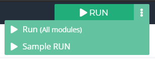
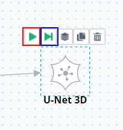
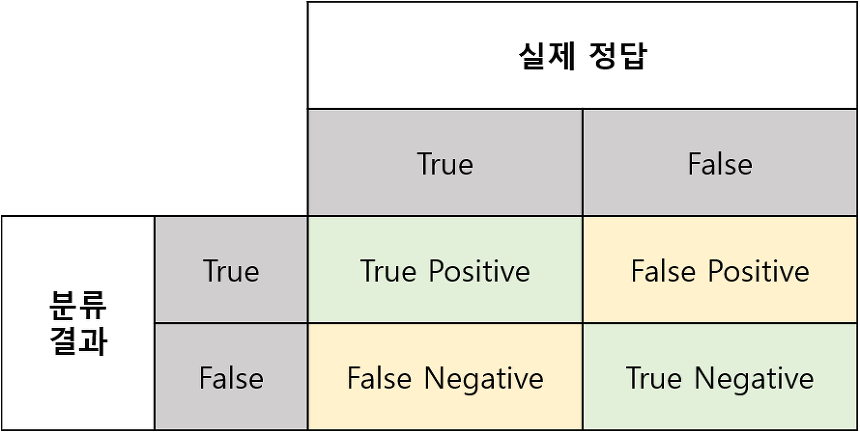

# 3. 사용 방법

***

## 3-6. 프로젝트 실행하기

### (1) 프로젝트 실행하기

프로젝트 파이프라인을 완성했다면 프로젝트를 실행시켜 학습을 수행할 수 있습니다.  
프로젝트를 실행하는 방법은 두 가지가 있습니다. 전체 파이프라인을 한 번에 실행시키거나, 개별 모듈 단위로 실행시킬 수 있습니다.

 

#### 1) 전체 실행

상단 우측의 `RUN` 버튼을 눌러 전체 파이프라인을 한 번에 실행할 수 있습니다.  
`RUN` 버튼의 우측 점선 버튼을 눌러 세부적인 실행 옵션을 선택할 수 있습니다. 해당 버튼을 클릭하면 아래와 같이 2가지의 실행 아이콘이 팝업됩니다.

- `RUN(All modules)` 버튼은 기존의 RUN 버튼과 동일하게 전체 모듈을 실행합니다. 파이프라인의 가장 좌측 모듈부터 순차적으로 연결된 모듈들을 실행합니다.
- `Sample RUN` 버튼은 전체 데이터셋을 활용해서 실행하는 것이 아닌 데이터셋의 일부 만을 사용해서 프로젝트 파이프라인을 실행합니다. 데이터셋이 매우 커서 각 모듈의 처리 시간이 긴 경우, 파이프라인을 수정했을 때 처음부터 다시 오랜 시간에 걸쳐 실행해야 합니다. 이 경우 Sample RUN을 사용하면 일부 데이터만를 이용해 데이터의 변화 양상을 살펴볼 수 있습니다. Sample RUN을 이용해 수정 과정을 거친 뒤 전체 데이터셋으로 완성된 프로젝트를 실행하면 효율적으로 프로젝트를 진행할 수 있습니다.

 

#### 2) 모듈 별 실행

모듈 별 실행은 두 가지 방법이 있습니다.  
- Run 버튼을 클릭하면 해당 모듈 하나만 실행됩니다.  
- Step forward 버튼을 클릭하면 해당 모듈과 그 이후로 연결되어 있는 모든 모듈들이 순차적으로 실행됩니다.

  

### (2) 결과 확인하기

<!-- 하단의 Output 탭, Files 탭과 우측 View 탭을 이용해 결과를 확인하는 방법 -->

실행이 완료된 모듈은 초록색으로 변하고 완료 아이콘이 표시됩니다.  
모듈 아래에는 출력 데이터의 Shape가 표시됩니다. (None은 해당 axis의 크기가 통일되지 않았음을 의미합니다.)

 

하단의 Files Tab에서 각 데이터의 상태를 확인할 수 있습니다.

예시로, [256 x 256] Resize 모듈을 통과한 후 모든 데이터의 크기가 [256 x 256]으로 통일되었음을 확인할 수 있고,  
Color to Grayscale 모듈을 통과한 후 데이터의 Color Mode가 RGB에서 Grayscale로 변경되었음을 확인할 수 있습니다.

 

Neural Network 모듈을 실행하면 하단에 Output 탭이 추가됩니다.  
Output 탭에서 학습 결과를 실시간으로 확인할 수 있습니다.  
Output 탭에서는 Epoch 별로 다양한 성능 수치를 수치와 그래프로 확인할 수 있습니다. 그래프에 마우스를 가져가면 각 시점에서의 정확한 수치를 확인할 수 있습니다.  

각 성능 수치에 대한 자세한 설명은 아래의 (3) 성능 평가를 참고 바랍니다.

 

{: width="40%"}

우측의 View Tab에서 모듈의 출력 영상을 확인할 수 있습니다.  
특히, Neural Network 모듈의 경우는 신경망이 영상의 어느 부분을 보고 판단했는지를 알려주는 Grad-CAM Image가 추가로 제공됩니다.  
(* Grad-CAM Image는 100% 정확한 것은 아니므로 참고사항으로만 이용하시기 바랍니다.)

  

### (3) 성능 평가

<!-- 각 Measurement에 대한 설명 -->

성능 평가는 인공지능 학습 과정에서 매우 중요한 부분입니다.  

각종 성능지표는 학습이 정상적으로 수행되고 있는가, 그렇지 않다면 어떠한 방향으로 학습이 되고 있는가를 판단할 수 있게 해 줍니다. 이를 통해 연구자는 전체적인 파이프라인의 수정 방향을 알 수 있고 나아가 연구 목표에 도달할 수 있습니다. 따라서 인공지능의 학습 과정과 학습 종료 후 성능을 평가해서 사용자의 기준에 맞는 성능에 도달했는지 확인하는 과정을 거쳐야 합니다.

지도학습(Supervised Learning)의 성능 평가 과정은 신경망 알고리즘의 예측 결과와 실제 현실의 정답(Ground Truth)인 Label 데이터를 비교해가며 올바르게 예측하였는지 비교하는 과정을 거치고 이를 사용자가 이해할 수 있는 수치로 표현하게 됩니다.

DEEP:PHI 플랫폼에서는 손실(Loss), 정확도(Accuracy), 민감도(Sensitivity), 특이도(Specificity) 등의 다양한 수치를 표와 그래프 형태로 제공합니다.

 

#### 각 Task 별 제공되는 성능 수치

신경망이 수행하는 Task에 따라 제공되는 성능 수치가 다릅니다. 

**1) Classification:**
- Loss
- Accuracy
- Accuracy by class
- Sensitivity
- Specificity
- PPV
- NPV
- Dice

 

**2) Segmentation:**
- Loss
- Accuracy
- Accuracy by class
- Sensitivity
- Specificity
- PPV
- NPV
- Dice
- mIOU

 

**3) Detection:**
- Loss
- mAP
- Accuracy by class

 

**4) Transformation:**
- Loss
- MAE
- MSE
- RMSE
- MSLE
- PSNR

 

#### 성능 수치 상세설명

성능 수치는 각 클래스 별로 정탐과 오탐을 체크하여 연산하는 것에서 시작합니다.  
아래 표에서 확인하는 것처럼 실제 True를 True라고 맞춘 경우를 True Positive(TP), 실제 True를 False라고 잘못 맞춘 경우를 False Negative(FN), 실제 False를 False라고 맞춘 경우를 True Negative(TN), 실제 False를 True라고 잘못 맞춘 경우를 False Positive(FN)라고 합니다.

**[높을수록 좋은 성능 수치]**

* **Accuracy** (정확도) : 정답을 맞춘 비율입니다.  

* **Accuracy by Class** : 각 Class 별 Accuracy를 계산합니다.

* **Sensitivity** (민감도) : 실제 True인 사람을 True라고 예측하는 비율입니다.  

* **Specificity** (특이도) : 실제 False인 사람을 False라고 예측하는 비율입니다.  

* **PPV** (양성예측도) : True라고 예측한 것 중 실제 True인 것의 비율입니다.  

* **NPV** (음성예측도) : False라고 예측한 것 중 실제 False인 것의 비율입니다.  

* **Dice coefficient** : 두 영역이 얼마나 겹치는지에 대한 비율입니다.  

* **mIoU** (mean Intersection over Union) : 두 영역이 얼마나 겹치는지에 대한 비율입니다.  

* **mAP** (mean Average Precision) : 각 class 별 AP(Average Precision)의 평균을 의미합니다. AP는 threshold를 조정함에 따라 달라지는 Precision(PPV) 값의 평균값입니다.

* **PSNR** (Peak Signal-to-Noise Ratio, 신호 대 잡음비) : 영상의 최대값에 대한 손실의 비를 나타냅니다.  

 

**[낮을수록 좋은 성능 수치]**

* **Loss** (손실) : 손실 함수에 의해 계산되는 값입니다.  

* **MAE** (Mean Absolute Error) : 정답 값과의 차(Error)의 절댓값의 평균입니다.  

* **MSE** (Mean Squared Error) : 정답 값과의 차(Error)의 제곱의 평균입니다.  

* **RMSE** (Root Mean Squared Error) : MSE를 보정해 준 값입니다.  

* **MSLE** (Mean Squared Log Error) : MSE를 보정해 준 값입니다.  

 

이러한 성능 수치들은 Neural Network 모듈의 Output 탭에서 표와 그래프의 형태로 쉽게 확인할 수 있습니다.  
또한 위 성능 수치들은 알고리즘의 예측 정확도이기 때문에 예측하려는 각 개별 클래스 별로 수치 연산을 수행합니다.  
DEEP:PHI에선 매 학습 단계마다, 매 클래스 별로 해당 수치를 연산해서 사용자가 확인할 수 있도록 제공하고 있습니다.
