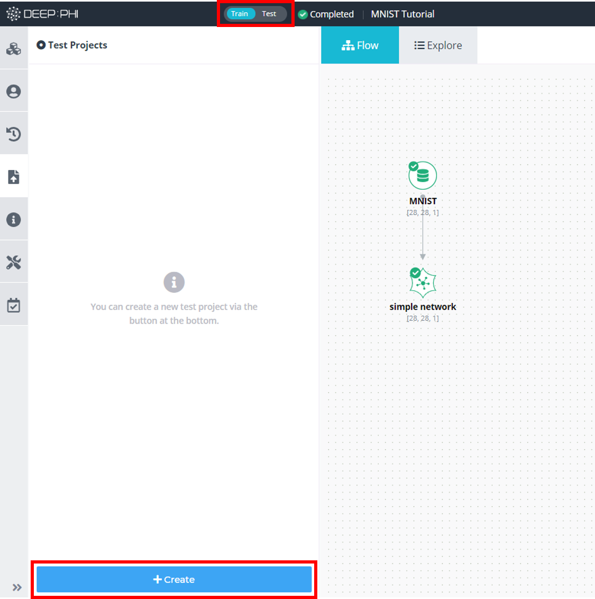

# 3. 사용 방법

***

## 3-7. 테스트 프로젝트 전환

학습이 완료되어 성능이 충분하다고 판단되는 프로젝트는 테스트 프로젝트로 전환할 수 있습니다.

테스트 프로젝트는 학습이 완료된 프로젝트에서 Deploy하여 실행하는데, 이 시점의 파이프라인과 각 모듈의 설정 상태 등을 그대로 고정시켜 inference 만을 수행하게 합니다. 이러한 테스트 프로젝트는 추후 공개될 DEEP:STORE을 통해 영상 판독을 수행하는 inference 앱의 형태로 배포될 수
있습니다.

같은 프로젝트 내에서 다수의 테스트 프로젝트가 존재할 수 있으며 각각의 테스트 프로젝트는 버전 관리를 통해 별개의 테스트 프로젝트로 관리됩니다.

 

학습이 완료된 프로젝트에서 상단 좌측에 존재하는 Train/Test 버튼을 통해 Train 모드에서 Test 모드로 전환하거나,  
좌측 메뉴의 Deployed 탭에서 Create 버튼을 눌러 테스트 프로젝트를 생성할 수 있습니다.

 

① 테스트 프로젝트의 이름과 버전을 입력하고, 저장할 신경망의 종류를 선택합니다.

 

② 테스트를 수행할 때 각 클래스 별로 일정 수치 이상인 데이터를 알람으로 알려주기 위한 threshold value를 입력합니다.

 

③ 이 단계에서는 각 평가 기준마다 가장 좋은 성능을 기록한 epoch를 알려줍니다.  
정확도(Accuracy)를 중점적으로 판단할 것인지, 손실 값(Loss)을 중점적으로 판단할 것인지, NPV나 PPV를 판단 기준으로 삼을 것인지 사용자의 판단에 따라 학습된 신경망을 선택합니다. 각 성능 수치를 클릭했을 때 하늘색으로 표시되는 영역이 같은 신경망입니다.  
하얀색 영역을 클릭하면 다른 신경망이 선택됩니다. 따라서 이를 이용하여 최적의 성능 수치라고 판단되는 성능을 클릭해서 해당 신경망을 배포하여 테스트 프로젝트를 구성하게 됩니다.  
목적에 따라 중점에 두는 평가척도가 좋은 시점을 선택합니다.

 

④ 마지막 단계에서는 선택한 신경망의 epoch와 해당 시점의 성능을 보여줍니다.  
해당 epoch를 사용하려면 OK를, 다른 epoch를 사용하려면 이전 단계로 돌아갑니다.

 

⑤ 배포된 테스트 프로젝트의 화면입니다. RUN 버튼을 눌러 테스트를 진행할 수 있고 Deployed 탭에서 배포된 프로젝트의 버전 정보와 성능 정보를 확인할 수 있습니다.