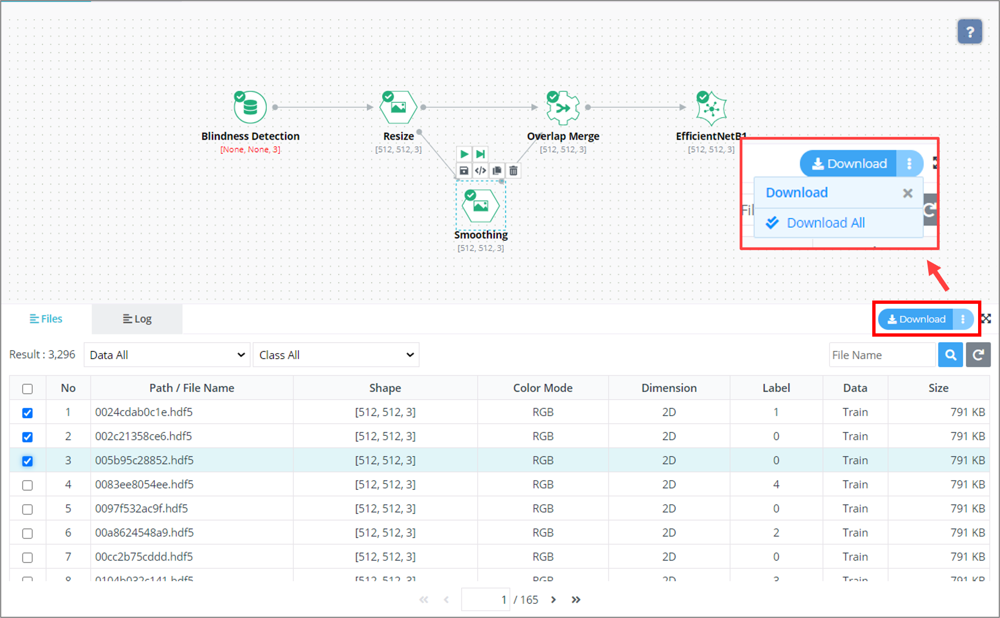

# 3. 사용 방법

***

## 3-8. 부가 기능

DEEP:PHI는 사용자의 편의성 증대를 위해 다양한 부가기능을 제공하고 있습니다.

프로젝트 공동연구를 위해 다른 사용자들을 내 프로젝트에 초대하거나 직접 제작한 모듈과 프로젝트를 서로 공유할 수 있습니다.  
또한, 리소스 관리를 통해 GPU 배분을 관리하고 GPU를 이용한 학습 방식을 설정할 수 있으며  
연구 결과를 논문 등의 산출물로 제작하기 용이하도록 원본 데이터셋을 포함한 각 모듈의 결과 이미지와 프로젝트 파이프라인의 스크린샷을 다운로드할 수 있습니다.

 

### (1) 프로젝트 공동연구

#### 프로젝트 구성원 관리

프로젝트 내부에서 좌측 Members 탭에서 현재 프로젝트의 구성원을 확인하고 관리할 수 있습니다.

우측 상단의 Invite 버튼을 클릭해 프로젝트 구성원을 추가할 수 있습니다.  
추가하고자 하는 사용자의 DEEP:PHI 플랫폼 계정(이메일 주소), 프로젝트 내에서의 역할과 초대 메시지를 입력하고 Invite를 누르면 해당 사용자에게 초대장이 발송됩니다.

 

Setting 버튼을 클릭해 프로젝트 구성원을 관리할 수 있습니다.  
현재 구성원의 역할을 수정하거나 제거할 수 있고,  
Role 옆의 설정 버튼을 클릭하면 각 역할의 권한을 설정할 수 있습니다.

 

#### 일정 관리

좌측 메뉴의 TODO 탭에서 프로젝트에서 TODO list를 관리할 수 있습니다.

  

### (2) 리소스 관리

좌측 메뉴의 Settings 탭에서 프로젝트의 리소스를 관리할 수 있습니다.  
현재 보유하고 있는 GPU 개수 중 해당 프로젝트에 사용할 GPU의 개수를 설정하고, 분산 학습 방식을 설정할 수 있습니다.

BATCH 타입은 하나의 batch가 여러 개의 GPU에 분산되는 방식이며, batch size를 더 크게 할 수 있습니다.  
STEP 타입은 하나의 batch가 하나의 GPU에서 병렬적으로 학습하는 방식이며, 학습 시간을 단축시킬 수 있습니다.

  

### (3) 결과 다운로드

연구 결과를 산출물로 편리하게 제작할 수 있게끔 도와주는 기능들이 있습니다.

 

- Flow space 의 우측 상단에 있는 카메라 아이콘을 클릭하면 프로젝트 파이프라인을 사진파일로 내보낼 수 있습니다.

 

- 하단의 Files 탭에서 Download를 클릭하여 선택한 파일 혹은 전체 데이터셋을 다운로드할 수 있습니다.

 

- 원본 데이터 파일과 라벨 파일, 예측 파일 중 필요한 파일만 다운로드할 수 있습니다.

 

- 파일의 크기가 매우 큰 경우 압축이 진행되며, 진행중인 내역은 Dashboard 의 Downloaded Files 탭에서 확인할 수 있습니다.  
백그라운드에서 압축 작업이 수행 중이면 우측에 진행률이 표시 됩니다. 압축 작업이 완료되어 다운로드가 가능해지면 위 이미지와 같이 우측에 Download 버튼이 활성화됩니다. 활성화된 다운로드 링크는 만료 기간이 존재하며 만료 이후엔 다운로드할 수 없습니다.

 

- 기한이 만료되고 나서 파일 다운로드를 수행하려면 다시 프로젝트 내부에서 다운로드를 요청해야 합니다.