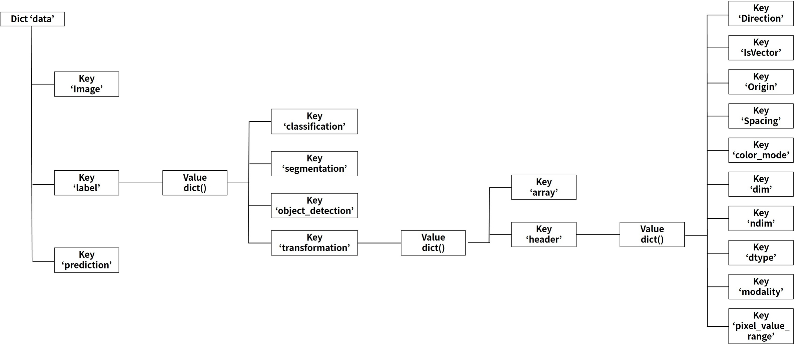

# 4. 부록

***

## 4-2. DEEP:PHI 플랫폼 모듈의 입/출력 데이터 구조

DEEP:PHI 플랫폼의 Image Processing과 Neural Network는 Python 기반으로 제작되어 있습니다. 따라서 Custom 모듈을 생성하는 경우 Python으로 해당 기능의 소스코드를 직접 제작해야 합니다.  
이러한 경우를 위해 DEEP:PHI 플랫폼의 모듈은 각각 사전에 규약된 입력과 출력의 형태를 통해 필요한 정보와 데이터를 사용해서 동작을 수행하는 실행 부분만 코딩하면 그 외의 부분들은 자동으로 동작되게 되어있습니다. 이를 위한 각 모듈의 입력과 출력은 Python Dictionary로 생성되어 있습니다.  
Python Dictionary는 Python 언어의 기본 자료형으로써 Key:Value로 구성된 형태의 오브젝트입니다.  
Python Dictionary 자료형은 오브젝트에 접근할 때 Key를 Dictionary 내에서 검색하여 Value에 접근하는 방식을 사용합니다.

``` python
#ex) 주소록 = {'홍길동':'01011111111', '임꺽정':'01022222222', .... }
print(주소록['홍길동'])
'01011111111'
```

각 모듈이 사용하는 Dictionary 오브젝트 이름은 `data`입니다. Dictionary `data`는 `image`, `label`, `prediction`의 key를 가지고 있으며 각각의 key의 value로 하위 Dictionary를 가지고 있습니다.  
이를 구조도로 표현하면 아래와 같습니다.

### (1) data['image']의 구조


| Dictionary Key:value                         | Data Explanation                                                                                                            | Data Example                                |
|----------------------------------------------|-----------------------------------------------------------------------------------------------------------------------------|---------------------------------------------|
| data['image']['array']                       | Input image array (numpy array)                                                                                             |                                             |
| data['image']['header']['Direction']         | Direction matrix. Default is identity. mapping, rotation, between direction of the pixel/voxel axes and physical directions | np.array([1., 0., 0., 1.])                  |
| data['image']['header']['IsVector']          | color channel 유무                                                                                                          | True / False                                |
| data['image']['header']['Origin']            | coordinates of the pixel/voxel with index (0,0,0) in physical units                                                         | np.array([0., 0.])                          |
| data['image']['header']['Spacing']           | Distance between adjacent pixels/voxels in each dimension given in physical units.                                          | np.array([2., 1.1213])                      |
| data['image']['header']['color_mode']        | color channel type                                                                                                          | 'RGB' / 'L' (grayscale) / 'Binary' (binary) |
| data['image']['header']['dim']               | image dimension                                                                                                             | 2 / 3                                       |
| data['image']['header']['ndim']              | image shape의 dimension                                                                                                     | 2 / 3 / 4                                   |
| data['image']['header']['dtype']             | pixel data type                                                                                                             | uint8 / float16                             |
| data['image']['header']['modality']          | modality of medical image                                                                                                   | CT / MRI / Xray                             |
| data['image']['header']['pixel_value_range'] | image의 pixel값 중 최소, 최대 값의 범위                                                                                     | np.array([0, 255])                          |

### (2) data['label']의 구조

#### 1) data['label']['classification']의 구조


| Dictionary Key:value                                    | Data Explanation                | Data Example           |
|---------------------------------------------------------|---------------------------------|------------------------|
| data['label']['classification']['array']                | one-hot encoding 된 label array | np.array([1., 0.])     |
| data['label']['classification']['header']['num_class']  | 전체 class 수                   | 2                      |
| data['label']['classification']['header']['class_name'] | 각 class 명의 list              | ['normal', 'abnormal'] |

#### 2) data['label']['segmentation']의 구조


| Dictionary Key:value                                         | Data Explanation                                                                                                            | Data Example                                |
|--------------------------------------------------------------|-----------------------------------------------------------------------------------------------------------------------------|---------------------------------------------|
| data['label']['segmentation']['array']                       | Label image array(numpy array)                                                                                              |                                             |
| data['label']['segmentation']['header']['Direction']         | Direction matrix. Default is identity. mapping, rotation, between direction of the pixel/voxel axes and physical directions | np.array([1., 0., 0., 1.])                  |
| data['label']['segmentation']['header']['IsVector']          | color channel 유무                                                                                                          | True / False                                |
| data['label']['segmentation']['header']['Origin']            | coordinates of the pixel/voxel with index (0,0,0) in physical units                                                         | np.array([0., 0.])                          |
| data['label']['segmentation']['header']['Spacing']           | distance between adjacent pixels/voxels in each dimension given in physical units                                           | np.array([2., 1.1213])                      |
| data['label']['segmentation']['header']['color_mode']        | color channel type                                                                                                          | 'RGB' / 'L' (grayscale) / 'Binary' (binary) |
| data['label']['segmentation']['header']['dim']               | image dimension                                                                                                             | 2 / 3                                       |
| data['label']['segmentation']['header']['ndim']              | image shape의 dimension                                                                                                     | 2 / 3 / 4                                   |
| data['label']['segmentation']['header']['dtype']             | pixel data type                                                                                                             | uint8 / float32                             |
| data['label']['segmentation']['header']['class_name']        | 각 class 명의 list                                                                                                          | ['background', 'target']                    |
| data['label']['segmentation']['header']['class_fraction']    | 각 class 별로 라벨 데이터에서 차지하는 면적 비율                                                                            | np.array([0.7, 0.3])                        |
| data['label']['segmentation']['header']['num_class']         | 전체 class 수                                                                                                               | 2                                           |
| data['label']['segmentation']['header']['modality']          | modality of medical image                                                                                                   | CT / MRI / Xray                             |
| data['label']['segmentation']['header']['piexl_value_range'] | image의 pixel값 중 최소, 최대 값의 범위                                                                                     | np.array([0, 255])                          |

#### 3) data['label']['detection']의 구조


| Dictionary Key:value                                     | Data Explanation                                      | Data Example                                               |
|----------------------------------------------------------|-------------------------------------------------------|------------------------------------------------------------|
| data['label']['object_detection']['bbox_coordinate']     | [xmin,ymin,xmax,ymax] box의 좌표 값                   | np.array([[173., 150., 348., 350.], [10., 10., 50., 80.]]) |
| data['label']['object_detection']['bbox_class']          | 각 box의 class에 대한 one-hot encoding 된 numpy array | np.array([1.,0.,0.,0.,0.], [0.,0.,1.,0.,0.])               |
| data['label']['object_detection']['header']['classes']   | 각 class에 대한 index 및 이름                         | {'dog': 0, 'cat':1, 'person' : 2, 'bird' : 3, 'boat' : 4)} |
| data['label']['object_detection']['header']['num_class'] | 전체 class 수                                         | 4                                                          |

#### 4) data['label']['transformation']의 구조



| Dictionary Key:value                                           | Data Explanation                                                                                                            | Data Example                                |
|----------------------------------------------------------------|-----------------------------------------------------------------------------------------------------------------------------|---------------------------------------------|
| data['label']['transformation']['array']                       | Label image array(numpy array)                                                                                              | -                                           |
| data['label']['transformation']['header']['Direction']         | Direction matrix. Default is identity. mapping, rotation, between direction of the pixel/voxel axes and physical directions | np.array([1., 0., 0., 1.])                  |
| data['label']['transformation']['header']['IsVector']          | color channel 유무                                                                                                          | True / False                                |
| data['label']['transformation']['header']['Origin']            | coordinates of the pixel/voxel with index (0,0,0) in physical units                                                         | np.array([0., 0.])                          |
| data['label']['transformation']['header']['Spacing']           | distance between adjacent pixels/voxels in each dimension given in physical units                                           | np.array([2., 1.1213])                      |
| data['label']['transformation']['header']['color_mode']        | color channel type                                                                                                          | 'RGB' / 'L' (grayscale) / 'Binary' (binary) |
| data['label']['transformation']['header']['dim']               | image dimension                                                                                                             | 2 / 3                                       |
| data['label']['transformation']['header']['ndim']              | image shape의 dimension                                                                                                     | 2 / 3 / 4                                   |
| data['label']['transformation']['header']['dtype']             | pixel data type                                                                                                             | uint8 / float32                             |
| data['label']['transformation']['header']['modality']          | modality of medical image                                                                                                   | CT / MRI / Xray                             |
| data['label']['transformation']['header']['piexl_value_range'] | image의 pixel값 중 최소, 최대 값의 범위                                                                                     | np.array([0, 255])                          |

### (3) data['prediction']의 구조


| Dictionary Key:value                                      | Data Explanation                                        | Data Example                    |
|-----------------------------------------------------------|---------------------------------------------------------|---------------------------------|
| data['prediction']['classification']['array']             | prediction result가 one-hot encoding 된 결과            | np.array([1., 0.])              |
| data['prediction']['classification']['header']            | 메타데이터 보관을 위한 비어 있는 Dictionary             | -                               |
| data['prediction']['segmentation']['array']               | prediction result가 image array(np.array)로 저장된 결과 | -                               |
| data['prediction']['segmentation']['header']              | 메타데이터 보관을 위한 비어 있는 Dictionary             | -                               |
| data['prediction']['object_detection']['bbox_coordinate'] | prediction result의 bbox 좌표 정보가 담긴 결과          | np.array([180., 149. 350. 348]) |
| data['prediction']['object_detection']['bbox_class']      | prediction result의 해당 bbox의 클래스 정보가 담긴 결과 | np.array([1.,0.,0.,0.,0.])      |
| data['prediction']['object_detection']['header']          | 메타데이터 보관을 위한 비어 있는 Dictionary             | -                               |
| data['prediction']['transformation']['array']             | prediction result가 image array(np.array)로 저장된 결과 | -                               |
| data['prediction']['transformation']['header']            | 메타데이터 보관을 위한 비어 있는 Dictionary             | -                               |
