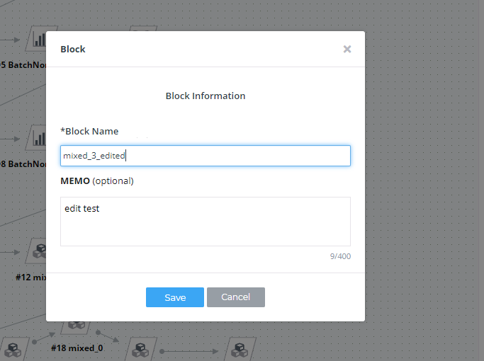
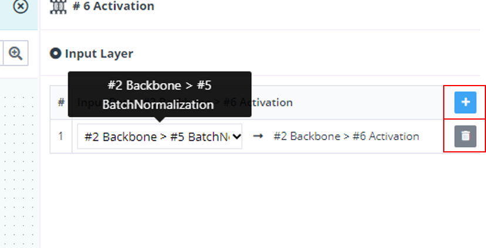

# Version 2020-04.1126016

#### New Feature

- 뉴럴 네트워크 편집 시 블록의 이름 및 설명 Edit 기능 추가

1. 생성 및 편집을 한 블록을 선택 하면 나오는 Info 탭 하단 Edit 버튼 선택

2. 블록의 이름과 설명 수정 후 Save 버튼 선택

3. 사용자가 수정한 이름과 설명으로 변경.

- 뉴럴 네트워크 편집 시 멀티 Input & Output 형태로 편집 가능 하도록 기능 추가

#### Improvement

- Hyper-parameter Auto-Tunning 과정에서 over-fitting을 피하기 위해 perturbation을 주는 로직을 추가하였습니다.

#### Bug

- 데이터셋 업로드시 확장자가 대문자인 경우 업로드가 안되는 버그 수정 ex) NII가 확장자인 경우
- Hyper-parameter Auto-Tunning 과정에서 learning rate이 1보다 커지는 버그 수정

#### Task

- 튜토리얼 동영상 추가
  - [1-1. Upload Dataset](https://www.youtube.com/watch?v=Lq3aRIJWJzU)  
  - 1-2. Dataset Structure
    - [1-2-1. Classification Dataset Structure](https://www.youtube.com/watch?v=C_kyji4VdFY)
    - [1-2-2. Segmentation Dataset Structure](https://www.youtube.com/watch?v=1alhmYLbJVM)
    - [1-2-3. Detection Dataset Structure](https://www.youtube.com/watch?v=fnlcc8pNpFY)
    
- 메뉴얼 업데이트
  - [3-5.6. Hyper-parameter Auto-Tunning](https://deepphi.github.io/manual/chapter3/3-5.성능_고도화.html#6-hyper-parameter-auto-tunning)