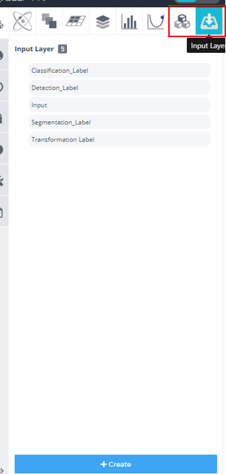
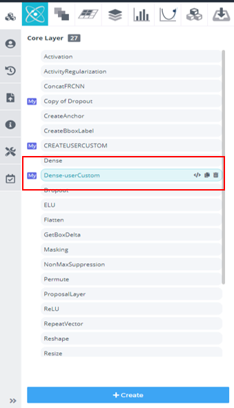
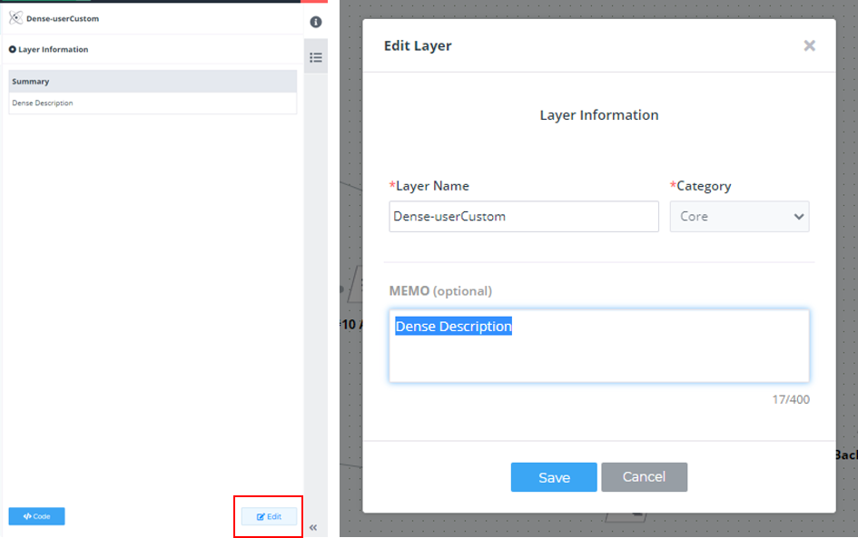
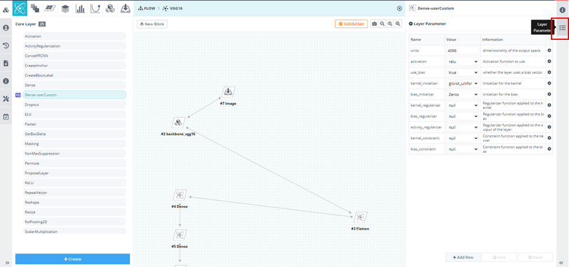
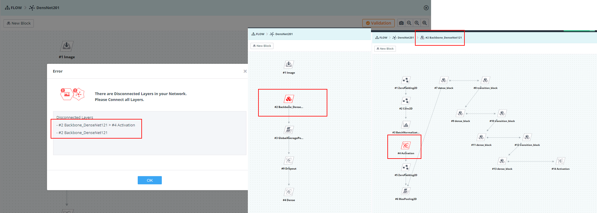

# Version 2020-04.1229017

#### New Feature

1.뉴럴네으퉈크 모델러에 새로운 카테고리 추가  

&nbsp;&nbsp;(1) Input Layer Category 추가  

&nbsp;&nbsp;(2) Block Layer Category 추가  

&nbsp;&nbsp;  

2.뉴럴네트워크 모델러 편집기 기능 업데이트  

&nbsp;&nbsp;(1) Layer 생성 기능 추가  

&nbsp;&nbsp;&nbsp;&nbsp;  

&nbsp;&nbsp;(2) Layer 복사 삭제 기능 추가    

&nbsp;&nbsp;&nbsp;&nbsp;기존에 존재하는 Layer 를 복사 하여 사용자 개인의 Layer 로 편집 가능  
&nbsp;&nbsp;&nbsp;&nbsp;  

&nbsp;&nbsp;(3) Layer 이름 및 설명 편집 기능 추가    

&nbsp;&nbsp;&nbsp;&nbsp;Edit 버튼 클릭을 통해 My Layer 의 이름 및 설명 편집 가능  
&nbsp;&nbsp;&nbsp;&nbsp;  

&nbsp;&nbsp;(4) Layer 소스 코드 편집 기능 추가    

&nbsp;&nbsp;&nbsp;&nbsp;<-> 버튼 과 Code 버튼 선택을 통해 코드 편집창 진입 가능  
&nbsp;&nbsp;&nbsp;&nbsp;  

&nbsp;&nbsp;&nbsp;&nbsp;Layer 들을 실제로 구성하고 있는 소스 코드를 확인 및 My layer 에 한해서 편집 가능  
&nbsp;&nbsp;&nbsp;&nbsp;  

&nbsp;&nbsp;(5) Layer 파라미터 편집 기능 추가    

&nbsp;&nbsp;&nbsp;&nbsp;소스코드를 편집 가능 함에 따라 소스코드에 사용하는 파라미터 편집 가능    
&nbsp;&nbsp;&nbsp;&nbsp;  
&nbsp;&nbsp;&nbsp;&nbsp;  

&nbsp;&nbsp;(6) 뉴럴네트워크를 구성하고 있는 Layer, Block 를 My 로 저장 기능 추가    

&nbsp;&nbsp;&nbsp;&nbsp;뉴럴 네트워크에서 사용 하기위해 사용자가 편집한 Layer 를 My로 저장하여 다른 네트워크 조립 시에 재사용 가능  

&nbsp;&nbsp;&nbsp;&nbsp;뉴럴 네트워크에서 자주 사용하는 Block를 My 로 저장 하여 다양한 네트워크 조립 시에 재사용 가능  

&nbsp;&nbsp;&nbsp;&nbsp;  

#### Improvement  

1.뉴럴네트워크 모델러 편집기의 Validation 기능 강화  

&nbsp;&nbsp;Validation 를 통해 문제가 발생하는 Layer 에 대해 편집기에서 빨간색 Layer로 표현    
&nbsp;&nbsp;  

2.Scheduled 상태 추가  
   
&nbsp;&nbsp;(1) 모듈 실행 시 시스템 가용 자원이 부족할 경우 Scheduled 상태로 모듈 상태가 변경되며, 가용자원이 확보 되면 자동으로 실행 상태로 변경됨  

&nbsp;&nbsp;(2) Scheduled 상태가 되면 현재 대기 중인 모듈의 이름과 순번을 확인 Scheduled 버튼을 클릭하여 확인 가능  
&nbsp;&nbsp;&nbsp;&nbsp;    

#### Task

1.튜토리얼 동영상 추가  

2.메뉴얼 업데이트  

&nbsp;&nbsp;[3-5.6. 커스텀 Layer 만들기](https://deepphi.github.io/manual/chapter3/3-5.성능_고도화.html#6-hyper-parameter-auto-tunning)  

